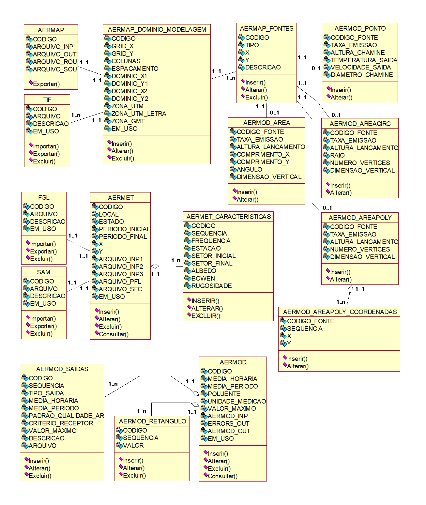

> **Universidade** **Tecnológica** **Federal** **do** **Paraná** **-**
> **Câmpus** **Toledo** **Programa** **de** **Pós-Graduação** **em**
> **Tecnologias** **em** **Biociências**
>
> **Desenvolvimento** **de** **uma** **Ferramenta** **de** **Software**
> **Open-Source** **para** **Apoiar** **a** **Modelagem** **de**
> **Dispersão** **Atmosférica**
>
> **Anderson** **Alexandre** **Borges**
>
> **Documentação** **do** **Software** **AERMOD** **Open**
>
> *CAMPUS* *Toledo*, Junho, 2023
>
> **SUMÁRIO**
>
> **1** **INTRODUÇÃO**
>
> ERRO! INDICADOR NÃO DEFINIDO.
>
> **1.1** **Paginação**
> **.............................................................................................**Erro!
> Indicador não definido.
>
> **1.2** **Exemplos** **de** **utilização** **de** **numeração**
> **progressiva..........................**Erro! Indicador não definido.
>
> **2** **SEÇÃO** **PRIMÁRIA** **(CAIXA** **ALTA** **E** **NEGRITO)**
> ERRO! INDICADOR NÃO DEFINIDO.
>
> **2.1** **Seção** **secundária** **(negrito)**
> **.................................................................**Erro!
> Indicador não definido.
>
> 2.1.1 Seção terciária (sem
> negrito)..................................................................**Erro!**
> **Indicador** **não** **definido.**
>
> <u>2.1.1.1</u> <u>Seção quaternária
> (sublinhado)..............................................................**Erro!**</u>
> **<u>Indicador não definido.</u>**
>
> *2.1.1.1.1* *Seção* *quinária*
> *(itálico)...........................................................................**Erro!***
> ***Indicador*** ***não*** ***definido.***
>
> **3** **DESENVOLVIMENTO**
>
> ERRO! INDICADOR NÃO DEFINIDO.
>
> **3.1** **Regras** **gerais** **de**
> **apresentação...........................................................**Erro!
> Indicador não definido.
>
> **3.2**
> **Margens.................................................................................................**Erro!
> Indicador não definido.
>
> **3.3**
> **Espaçamento........................................................................................**Erro!
> Indicador não definido.
>
> **3.4** **Ilustrações**
> **............................................................................................**Erro!
> Indicador não definido.
>
> **3.5**
> **Tabelas..................................................................................................**Erro!
> Indicador não definido.
>
> **3.6** **Citações**
> **................................................................................................**Erro!
> Indicador não definido.
>
> **4** **CONCLUSÃO** **(OU** **CONSIDERAÇÕES** **FINAIS)** ERRO!
> INDICADOR NÃO DEFINIDO.
>
> **REFERÊNCIAS......................................................................................**Erro!
> Indicador não definido.
>
> **APÊNDICE** **A** **-** **Questionário** **de** **pesquisa**
> **..........................................**Erro! Indicador não
> definido.
>
> **APÊNDICE** **B** **-** **Roteiro** **da** **entrevista**
> **..................................................**Erro! Indicador
> não definido.
>
> **ANEXO** **A** **-** **Lei** **n.** **9.610,** **de** **19** **de**
> **fevereiro** **de** **1998.........................**Erro! Indicador
> não definido.
>
> **Resumo**
>
> Esta documentação, apresenta o desenvolvimento do software AERMOD Open
>
> para apoiar e automatizar a geração dos arquivos de entrada do sistema
> de modelagem de dispersão atmosférica AERMOD, contribuindo assim com
> profissionais e/ou pesquisadores da área. O software deverá
> automatizar a configuração dos seus arquivos de entrada para cada
> etapa de processamento AERMAP, AERMET e o próprio processador
> principal AERMOD. O profissional terá uma interface amigável
> facilitando a execução no modelo de dispersão de forma eficaz. O
> sistema foi implementado em .Net C# através da plataforma de
> desenvolvimento Visual Studio Community 2022, usando o
>
> Banco de Dados Relacional MySQL 5.6.20 e a metodologia utilizada foi a
> Análise Orientada a Objeto.
>
> **Objetivos**
>
> O software tem como objetivo principal automatizar a geração dos
> arquivos de entrada das etapas de processamento AERMAP, AERMET e
> AERMOD do sistema de modelagem de dispersão atmosférica AERMOD.
> Através de uma interface amigável o software permite gerenciar fontes
> emissoras, arquivos topográficos, meteorológicos e de
>
> rádio sondagem. Com isso o sistema irá auxiliar os profissionais da
> área ambiental garantido maior eficiência nos períodos de simulação
> para cada poluente configurado.
>
> **3.** **Levantamento** **de** **Dados**
>
> Contemplam as subfases de planejamento ou preparação de levantamento
> ou
>
> realização, de análise dos dados ou interpretação e de documentação ou
> conclusão. Possibilita o uso dastécnicas de observação pessoal,
> questionário, entrevista, seminário, dinâmica de grupo, pesquisa e
> mista. Determina claramente os requisitos funcionais através da
> análise dos requisitos.
>
> **3.1** **Processo** **AERMAP**
>
> **3.1.1** **Cadastro** **de** **arquivos** **(TIF)**
>
> 3.1.1.1 O software permite que o usuário possa importar arquivos
> topográficos com extensão (TIF);
>
> 3.1.1.2 O sistema possibilita a exclusão de arquivos conforme a
> necessidade do usuário; 3.1.1.3 O sistema pode exportar arquivos
> selecionados.
>
> **3.1.2** **Fontes** **emissoras**
>
> 3.1.2.1 Caso a fonte emissora não esteja cadastrada no sistema o
> sistema possui um cadastro de fontes emissoras com informações
> específicas e devidas coordenadas;
>
> 3.1.2.2 O sistema pode inserir uma fonte emissora caso este não esteja
> cadastrado no sistema;
>
> 3.1.2.3 O sistema pode alterar os dados da fonte caso esteja
> cadastrada;
>
> 3.1.2.4 O sistema pode excluir a fonte emissora cadastrada e não
> esteja vinculada com outra tabela no sistema;
>
> 3.1.2.5 O sistema pode realizar consultas para realizar possíveis
> alterações.
>
> **3.1.3** **Domínio** **e** **Grade** **de** **modelagem**
>
> 3.1.3.1 O sistema possui um cadastro de domínio e grade de modelagem
> caso o mesmo
>
> não esteja cadastrado no sistema solicitando dados específicos da área
> de estudo;
>
> 3.1.3.2 O sistema pode alterar o registro cadastrado caso seja
> necessário;
>
> 3.1.3.3 O sistema pode excluir o registro selecionado através da
> consulta existente no cadastro;
>
> 3.1.3.4 O sistema pode realizar consultas para realizar possíveis
> alterações.
>
> **3.1.4** **Execução**

3.1.4.1 O sistema permite a execução do pré-processador AERMAP gerando
arquivos de saída como AERMAP.INP, AERMAP.OUT, AERMAP.ROU e AERMAP.SOU;

> 3.1.4.2 O sistema fornece opção para exportar arquivos de saída
> gerados pelo processamento.
>
> **3.2** **Processo** **AERMET**
>
> **3.2.1** **Cadastro** **de** **arquivos** **(FSL)**
>
> 3.2.1.1 O software permite que o usuário possa importar arquivos de
> rádio sondagem
>
> com extensão (FSL);
>
> 3.2.1.2 O sistema possibilita a exclusão de arquivos conforme a
> necessidade do usuário; 3.2.1.3 O sistema pode exportar arquivos
> selecionados.
>
> **3.2.2** **Cadastro** **de** **arquivos** **(SAM)**
>
> 3.2.2.1 O software permite que o usuário possa importar arquivos
> meteorológicos de superfície horária com extensão (CSV) gerados pelo
> Instituto Nacional de Meteorologia INMET;
>
> 3.2.2.2 O sistema possibilita a exclusão de arquivos conforme a
> necessidade do usuário; 3.2.2.3 O sistema pode exportar arquivos
> selecionados;
>
> 3.2.2.4 O sistema converte arquivos (CSV) para (SAM) conforme
> parâmetros definidos no cadastro pelo usuário.
>
> **3.2.3** **Cadastro** **de** **definições**
>
> 3.2.3.1 Caso não exista definição de características de superfície
> cadastrado no sistema, o mesmo possui um cadastro de definições com
> informações de características específicas e devido período para
> simulações;
>
> 3.2.3.2 O sistemapodeinserir uma definição caso este nãoesteja
> cadastrado no sistema; 3.2.3.3 O sistema pode alterar os dados da
> definição caso esteja cadastrada;
>
> 3.2.3.4 O sistema pode excluir a definição cadastrada e não esteja
> vinculada com outra tabela no sistema;
>
> 3.2.3.5 O sistema pode realizar consultas para realizar possíveis
> alterações.
>
> **3.2.4** **Execução**
>
> 3.2.4.1 O sistema permite a execução do pré-processador AERMET gerando
> arquivos de saída como AERMET_1.INP, AERMET_2.INP, AERMET_3.INP,
> AERMET.PFL e AERMET.SFC;
>
> 3.2.4.2 O sistema fornece opção para exportar arquivos de saída
> gerados pelo processamento.
>
> **3.3** **AERMOD**
>
> **3.3.1** **Cadastro** **de** **definições**
>
> 3.3.1.1 Caso não exista definição de médias temporais, poluentes e
> arquivos de saída cadastrado no sistema, o mesmo possui um cadastro de
> definições com informações de médias temporais, horária, de todo
> período de simulação, poluentes e arquivos de saída;
>
> 3.3.1.2 O sistemapodeinserir uma definição caso este nãoesteja
> cadastrado no sistema; 3.3.1.3 O sistema pode alterar os dados da
> definição caso esteja cadastrada;
>
> 3.3.1.4 O sistema pode excluir a definição cadastrada;
>
> 3.3.1.5 O sistema pode realizar consultas para efetuar possíveis
> alterações.
>
> **3.3.2** **Cadastro** **de** **parâmetros**
>
> 3.3.2.1 Caso não exista parâmetros definidos para as fontes emissoras
> cadastradas no
>
> sistema, o mesmo possui um cadastro de parâmetros com informações
> específicas para cada tipo de fonte emissora sendo ponto, área, área
> polígono ou área círculo;
>
> 3.3.2.2 O sistema pode alterar os dados do parâmetro da fonte emissora
> caso esteja cadastrado;
>
> 3.3.2.3 O sistema pode realizar consultas para efetuar possíveis
> alterações.
>
> **3.3.3** **Execução**
>
> 3.3.3.1 O sistema disponibiliza a execução do processador principal
> AERMOD gerando arquivos de saída como AERMOD.INP, AERMOD.OUT,
> ERRORS.OUT e AERMOD.PLT;
>
> 3.2.4.2 O sistema fornece opção para exportar arquivos de saída
> gerados pelo processamento.
>
> **3.4** **Mapa**
>
> **3.4.1** **Mapa** **AERMAP**
>
> 3.4.1.1 O sistema possibilita a visualização do mapa da área de
> estudo, contendo o domínio, grade de modelagem e fontes emissoras
> cadastradas no sistema.
>
> **3.4.2** **Mapa** **AERMOD**
>
> 3.4.2.1 O sistema permite a visualização do mapa com as concentrações
> médias e suas
>
> coordenadas de cada poluente e arquivo gerado pelo processador
> principal AERMOD.
>
> **3.5** **Cópia** **de** **segurança**
>
> **3.5.1** **Efetuar** **cópia**
>
> 3.5.1.1 O sistema permite efetuar backup da estrutura, linhas ou
> registros das tabelas.
>
> **3.5.2** **Restaurar** **cópia**
>
> 3.5.2.1 O sistema pode restaurar cópia de segurança caso exista alguma
> criada pelo módulo de backup.
>
> **4.** **Documento** **de** **Requisitos**
>
> O documento de Requisitos tem a finalidade de identificar quais as
> necessidades do usuário e dar uma visão geral das funcionalidades, dos
> requisitos de qualidade e segurança do sistema.
>
> **4.1** **Visão** **Geral** **do** **Sistema**
>
> O sistema de modelagem AERMOD é um modelo regulatório de dispersão
> atmosférica gaussiano indicado pela Agênciade Proteção Ambiental dos
> Estados Unidos EPA. Contudo, preparar os arquivos para alimentar o
> sistema de modelagem não é uma tarefa trivial, propensa a erros e que
> requer grande atenção por parte dos profissionais. Neste sentido, este
> sistema de código aberto, tem por objetivo automatizar a geração dos
> arquivos de entrada dos processamentos AERMAP, AERMET e o processador
> principal AERMOD do sistema de modelagem AERMOD, contribuindo assim
> com profissionais e/ou pesquisadores da área. Através de uma interface
> amigável, o sistema permitirá que o profissional consiga configurar
> seus arquivos de entrada para cada etapa de processamento, facilitando
> a execução n modelo de dispersão de forma eficaz. Os resultados do
> sistema, poderão auxiliar universidades através da redução de custos
> com o uso de software proprietário e o incentivo de novos estudos
> sobre melhorias na qualidade do ar.
>
> O sistema proposto possuirá um gerenciamento do pré-processador
> AERMAP, AERMET e processador principal AERMOD apresentando as
> seguintes características:
>
> **4.2** **Requisitos** **funcionais** **AERMAP**
>
> **4.2.1** **Cadastro** **de** **arquivos** **(TIF)**
>
> 4.2.1.1 O sistema deve permitir importação de arquivos topográficos
> com extensão (TIF) onde os dados vão para o banco de dados onde é
> gerenciado suas referências, caso o arquivo não tenha cadastro no
> sistema;
>
> 4.2.1.2 O sistema deve emitir mensagem de erro se a extensão do
> arquivo selecionado para importação for diferente da extensão (TIF);
>
> 4.2.1.3 O sistema deve registrar o código, arquivo, descrição e status
> de uso ou não no sistema;
>
> 4.2.1.4 O sistema possibilita a exclusão de arquivos conforme a
> necessidade do usuário através de uma mensagem de confirmação ou não
> para exclusão;
>
> 4.2.1.5 O sistema pode exportar arquivos selecionados.
>
> **4.2.2** **Fontes** **emissoras**
>
> 4.2.2.1 O sistema deve permitir a inserção de fontes emissoras onde os
> dados vão para
>
> o banco de dados onde é gerenciado suas referências, caso não tenha
> cadastro no sistema;
>
> 4.2.2.2 O sistema deve emitir mensagem de erro se existir duplicidade
> dos dados comparados com os gravados no banco tanto na inserção quanto
> alteração;
>
> 4.2.2.3 O sistema deve emitir mensagem de erro caso algum campo não
> seja preenchido corretamente;
>
> 4.2.2.4 O sistema deve registrar o código, tipo da fonte (ponto, área,
> área polígono, área círculo) e coordenadas UTM X representando a
> longitude e Y latitude;
>
> 4.2.2.5 O sistema deve permitir alteração de fontes emissoras caso
> esteja cadastrada; 4.2.2.6 O sistema permite a exclusão de fonte
> emissora cadastrada e não esteja
>
> vinculada com outra tabela no sistema através de uma mensagem de
> confirmação ou não para exclusão;
>
> 4.2.2.7 O sistema permite realizar consultas para efetuar possíveis
> alterações.
>
> **4.2.3** **Domínio** **e** **Grade** **de** **modelagem**
>
> 4.2.3.1 O sistema deve registrar o código, coordenadas X e Y da grade
> de modelagem
>
> inferior esquerdo, colunas, espaçamento, coordenas X e Y do domínio de
> modelagem inferior esquerda, coordenadas X e Y superior direita, zona
> UTM numérica, letra da zona UTM, coordenadas universais de tempo UTC e
> status de uso ou não no sistema;
>
> 4.2.3.2 O sistema deve permitir inserção da grade e domínio de
> modelagem onde os dados vão para o banco de dados, caso não tenha
> cadastro;
>
> 4.2.3.3 O sistema deve emitir mensagem de erro se existir duplicidade
> dos dados comparados com os gravados no banco tanto na inserção quanto
> alteração;
>
> 4.2.3.4 O sistema deve emitir mensagem de erro caso algum campo não
> seja preenchido corretamente;
>
> 4.2.3.5 O sistema deve permitir alteração de registros cadastrados
> caso sejam necessários;
>
> 4.2.3.6 O sistema pode excluir o registro selecionado através da
> consulta existente no cadastro através de uma mensagem de confirmação
> ou não para exclusão;
>
> 4.2.3.7 O sistema pode realizar consultas para efetuar possíveis
> alterações.
>
> **4.2.4** **Execução**
>
> 4.2.4.1 O sistema deve executar o pré-processador AERMAP gerando
> arquivos de saída como AERMAP.INP, AERMAP.OUT, AERMAP.ROU e
> AERMAP.SOU;
>
> 4.2.4.2 O sistema deve emitir mensagem de erro caso exista algum dado
> faltante ou incorreto no cadastro de fontes emissoras ou domínio e
> grade de modelagem;
>
> 4.2.4.3 O sistema deve registrar no banco de dados o código, arquivo
> (INP), arquivo (OUT), arquivo (ROU) e arquivo (SOU);
>
> 4.2.4.4 O sistema fornece opção para exportar todos os arquivos de
> saída gerados pelo processamento;
>
> 4.2.4.5O sistemadeveemitirmensagemdeconfirmaçãoapós exportar
> arquivodesejado.
>
> **4.3** **Requisitos** **funcionais** **AERMET**
>
> **4.3.1** **Cadastro** **de** **arquivos** **(FSL)**
>
> 4.3.1.1O sistemadevepermitirimportaçãodearquivos de rádio sondagem
> comextensão
>
> (.FSL), onde os dados vão para o banco de dados caso não tenha
> cadastro; 4.3.1.2 O sistema deve emitir mensagem de erro se a extensão
> do arquivo selecionado
>
> para importação for diferente da extensão (FSL);
>
> 4.3.1.3 O sistema deve registrar o código, arquivo, descrição e status
> de uso ou não no sistema;
>
> 4.3.1.4 O sistema possibilita a exclusão de arquivos conforme a
> necessidade do usuário através de uma mensagem de confirmação ou não
> para exclusão;
>
> 4.3.1.5 O sistema pode exportar arquivos selecionados.
>
> **4.3.2** **Cadastro** **de** **arquivos** **(SAM)**
>
> 4.3.2.1 O sistema permite importação de arquivos meteorológicos de
> superfície horária
>
> com extensão (CSV) gerados pelo Instituto Nacional de Meteorologia
> INMET, sendo gravado no banco de dados caso não tenha cadastro;
>
> 4.3.2.2 O sistema deve emitir mensagem de erro se a extensão do
> arquivo selecionado para importação for diferente da extensão (CSV);
>
> 4.3.2.3 O sistema deve emitir mensagem de erro na conversão para
> extensão (SAM) caso exista dados incorretos ou faltantes;
>
> 4.3.2.4 O sistema deve registrar o código, arquivo, descrição e status
> de uso ou não no sistema;

4.3.2.5 O sistema possibilita a exclusão de arquivos conforme a
necessidade do usuário; 4.3.2.6 O sistema converte arquivos (CSV) para
(SAM) conforme parâmetros definidos

> no cadastro pelo usuário;
>
> 4.3.2.7 O sistema pode exportar arquivos (SAM) selecionados.
>
> **4.3.3** **Cadastro** **de** **definições**
>
> 4.3.3.1 O sistema deve registrar o código, local, estado, período
> inicial, período final,
>
> coordenadas X e Y, arquivo (INP) 1, arquivo (INP) 2, arquivo (INP) 3,
> arquivo (PFL), arquivo (SFC) e status de uso ou não no sistema;
>
> 4.3.3.2O sistemadeveregistrar definiçõesdas características de
> superfície como código, sequência, frequência, estação, setor inicial,
> final, albedo, bowen e rugosidade;
>
> 4.3.3.3 O sistema deve emitir mensagem de erro se existir duplicidade
> dos dados comparados com os gravados no banco tanto na inserção quanto
> alteração;
>
> 4.3.3.4 O sistema deve emitir mensagem de erro caso algum campo não
> seja preenchido corretamente;
>
> 4.3.3.5 O sistema deve permitir alteração de registros cadastrados
> caso sejam necessários;
>
> 4.3.3.6 O sistema pode excluir o registro selecionado através da
> consulta existente no cadastro e não esteja vinculada com outra tabela
> no sistema através de uma mensagem de confirmação ou não para
> exclusão;
>
> 4.3.3.7 O sistema pode realizar consultas para efetuar possíveis
> alterações.
>
> **4.3.4** **Execução**
>
> 4.3.4.1 O sistema deve executar o pré-processador AERMET gerando
> arquivos de saída
>
> como AERMET_1.INP, AERMET_2.INP, AERMET_3.INP, AERMET.PFL e
> AERMET.SFC;
>
> 4.3.4.2 O sistema deve emitir mensagem de erro na execução, caso
> exista algum dado faltante ou incorreto no cadastro de definições ou
> nos arquivos de entrada como de rádio sondagem ou meteorológico;
>
> 4.3.4.3 O sistema fornece opção para exportar todos os arquivos de
> saída gerados pelo processamento;
>
> 4.3.4.4O sistemadeveemitirmensagemdeconfirmaçãoapós exportar
> arquivodesejado.
>
> **4.4** **Requisitos** **funcionais** **AERMOD**
>
> **4.4.1** **Cadastro** **de** **definições**
>
> 4.4.1.1 O sistema deve registar médias temporais através do código,
> média horária, média do período, poluente, unidade de medição,
> retângulo e valor máximo.
>
> 4.4.1.2 O sistema deve registrar parâmetros de saídas como código,
> sequência, tipo de saída, média horária, média do período, padrão da
> qualidade do ar, critério do receptor, valor máximo, descrição e
> arquivo;
>
> 4.4.1.3 O sistema deve emitir mensagem de erro se existir duplicidade
> dos dados comparados com os gravados no banco tanto na inserção quanto
> alteração;
>
> 4.4.1.4 O sistema deve emitir mensagem de erro caso algum campo
> obrigatório esteja nulo/vazio ou não esteja preenchido corretamente;
>
> 4.4.1.5 O sistema pode alterar os dados de médias temporais ou
> parâmetros de saídas caso estejam cadastrados;
>
> 4.4.1.6 O sistema pode excluir o registro selecionado através da
> consulta existente no cadastro através de uma mensagem de confirmação
> ou não para exclusão;
>
> 4.4.1.7 O sistema pode realizar consultas para efetuar possíveis
> alterações ou definição do poluente para simulações.
>
> **4.4.2** **Cadastro** **de** **parâmetros**
>
> 4.4.2.1 O sistema deve registar parâmetros das fontes emissoras do
> tipo ponto através
>
> do código da fonte, taxa de emissão, altura da chaminé, temperatura de
> saída, velocidade de saída e diâmetro da chaminé;
>
> 4.4.2.2 O sistema deve registrar parâmetros das fontes emissoras do
> tipo área através do código da fonte, taxa de emissão, altura de
> lançamento, coordenadas X e Y, ângulo e dimensão vertical;
>
> 4.4.2.3 O sistema deve registrar parâmetros das fontes emissoras do
> tipo área polígono através do código da fonte, taxa de emissão, altura
> de lançamento, número de vértices, dimensão vertical e sequência de
> coordenadas X e Y do polígono;
>
> 4.4.2.4 O sistema deve registrar parâmetros das fontes emissoras do
> tipo área círculo através do código da fonte, taxa de emissão, altura
> de lançamento, raio, número de vértices e dimensão vertical;
>
> 4.4.2.5 O sistema deve emitir mensagem de erro caso algum campo
> obrigatório esteja nulo/vazio ou preenchido incorretamente;
>
> 4.4.2.6 O sistema pode alterar os parâmetros da fonte emissora
> selecionada caso seja necessário.
>
> **4.4.3** **Execução**
>
> 4.4.3.1 O sistema deve executar o processador principal AERMOD gerando
> arquivos de
>
> saída como AERMOD.INP, AERMOD.OUT, ERRORS.OUT e AERMOD.PLT; 4.4.3.2 O
> sistema deve emitir mensagem de erro na execução, caso exista algum
> dado
>
> faltante ou incorreto no cadastro de definições ou parâmetros do
> AERMOD ou nos processos AERMAP ou AERMET;
>
> 4.3.4.3 O sistema fornece opção para exportar todos os arquivos de
> saída gerados pelo processamento;
>
> 4.3.4.4O sistemadeveemitirmensagemdeconfirmaçãoapós exportar
> arquivodesejado.
>
> **4.5** **Requisitos** **funcionais** **do** **mapa**
>
> **4.5.1** **Mapa** **AERMAP**
>
> 4.5.1.1 O sistema deve emitir mensagem de erro caso exista algum dado
> faltante ou incorreto nos processos AERMAP ou AERMET para visualizar o
> mapa da área de estudo, domínio, grade de modelagem e fontes
> emissoras.
>
> **4.5.2** **Mapa** **AERMOD**
>
> 4.5.2.1 O sistema deve emitir mensagem de erro caso exista algum dado
> faltante ou incorreto nos processos AERMAP, AERMET ou AERMOD para
> visualizar o mapa da área de estudo, fontes emissoras e os pontos com
> as concentrações médias do poluente de cada coordenada definida pelo
> arquivo especificado.
>
> **4.6** **Requisitos** **funcionais** **da** **cópia** **de**
> **segurança**
>
> **4.6.1** **Efetuar** **cópia**
>
> 4.6.1.1 O sistema deve emitir mensagem de erro caso o diretório
> informado não exista ou aconteça algum erro no processo de criação da
> cópia de segurança da base de dados do sistema.
>
> **4.6.2** **Restaurar** **cópia**
>
> 4.6.2.1 O sistema deve emitir mensagem de erro caso o arquivo
> selecionado seja incompatível com a estrutura do banco de dados do
> sistema ou aconteça algum erro no processo de restauração da base de
> dados.
>
> **4.7** **Requisitos** **de** **Qualidade** **4.7.1**
> **Confiabilidade**
>
> 4.7.1.1 O sistema deve fornecer facilidades para a realização de
> backup e restauração
>
> dos arquivos do sistema.
>
> **4.7.2** **Eficiência**
>
> 4.7.2.1 No processo AERMET, o sistema converte o arquivo meteorológico
> em (CSV) para (SAM) com facilidade e agilidade para aumentar a
> produtividade dos pesquisadores ou profissionais da área ambiental,
> sendo que se ganha tempo nos processos de modelagem do sistema AERMOD;
>
> 4.7.2.2 O sistema permite executar os processadores AERMAP, AERMET e
> AERMOD de forma eficaz, automatizando a geração dos arquivos de
> entrada do sistema de modelagem contribuindo assim com arquivos
> precisos.
>
> **4.7.3** **Portabilidade**
>
> 4.7.3.1 O sistema deve rodar em computadores com processador Pentium
> dual core ou
>
> superior, memória RAM mínima de 4 GB, hard disk com 250 GB e roda na
> plataforma Windows 7 ou superior.
>
> **4.7.4** **Usabilidade**
>
> 4.7.4.1 O sistema permite uma fácil usabilidade com seus dadosnão
> tendo complexidade nos procedimentos dos dados permitindo uma fácil
> interação com o sistema.
>
> **5.** **Lista** **de** **Eventos**
>
> A lista de Eventos tem como objetivo, mostrar todos os eventos que o
> sistema
>
> possui, sua descrição, caso de uso que é gerado e a mensagem de
> retorno quando o caso de uso for executado.
>
> 5.1 Lista de Eventos do Sistema

||
||
||
||
||
||
||
||
||
||
||
||
||
||
||

> 6\. **Lista** **de** **Mensagens**
>
> A lista de Mensagens tem a finalidade de apresentar a forma de
> interação do sistema com o usuário. Ela identifica todas as respostas
> que o sistema deve emitir como resposta ao usuário.
>
> 6.1 Lista de Mensagens do Sistema

||
||
||
||
||
||
||
||
||
||

||
||
||
||
||

||
||
||
||

||
||
||
||

> **7.** **Diagrama** **de** **Caso** **de** **Uso** **por** **Ator**
>
> O diagrama de Caso de Uso por ator tem como finalidade representar
> quais as funções esperadas do sistema, ele mostra também o
> relacionamento entre os atores e os casos de uso dentro do sistema. Um
> ator é um agente externo que interage com o sistema. Ele é
> representado neste projeto pela figura de um homem estilizado. Os
> responsáveis (atores) pela inicialização dos casos de uso
> identificados neste projeto são: Profissionais ou Pesquisadores
> definidos como Usuário.
>
> **7.1** **Diagrama** **de** **Caso** **de** **Uso** **do** **Ator**
> **Usuário**
>
> *Dados* *Domínio/Grid* **Executar** **AERMAP**
>
> **Manutenir** **Domínio/Grid**
>
> *MSG* *03*

*MSG* *04* *Dados* *AERMAP*

> *MSG* *05*
>
> **Manutenir** **FSL**

*Dados* *FSL*

> *Dados* *Fonte* *Emissora* *MSG* *06*
>
> *MSG* *02*
>
> **Manutenir** **Fonte** **Emissora**

*Dados* *SAM*

> *MSG* *07* **Manutenir** **SAM**
>
> Usuário
>
> *Dados* *TIF* *Dados* *Características*
>
> *MSG* *01* **Manutenir** **Características**
>
> *MSG* *08* **Manutenir** **TIF** *MSG* *11* *MSG* *10* *Dados*
> *AERMET*
>
> *Dados* *AERMOD*
>
> *Dados* *Parâmetros*

*Dados* *Saídas* *MSG* *09* **Executar** **AERMET**

> **Executar** **AERMOD** **Manutenir** **Saídas** **Manutenir**
> **Parâmetros**
>
> **8.** **Descrição** **dos** **casos** **de** **Usos**
>
> A descrição dos Casos de Usos, descreve passo a passo cada caso de
> uso,
>
> mostrando o seu curso normal de forma a identificar os procedimentos
> corretos que o sistema executará. O curso alternativo demonstra as
> alternativas de comportamento que podem ocorrer em um caso de uso.
>
> **8.1** **–** **Número:** **01**
>
> Caso de Uso: **Manutenir** **TIF**
>
> Descrição: Este Caso de Uso demonstra a inclusão de um arquivo TIF no
> sistema. Ator: Usuário
>
> Importar TIF
>
> \<\<uses\>\> *MSG* *01*
>
> *Dados* *TIF*
>
> Usuário
>
> \<\<uses\>\>

**Manutenir** **TIF** Exportar TIF

> \<\<uses\>\>
>
> Excluir TIF
>
> Curso Normal
>
> 1\. O usuário informa o arquivo TIF para importação; 2. O sistema faz
> a validação do arquivo;
>
> 3\. O sistema inclui o arquivo.
>
> Curso Alternativo
>
> 2.1. Caso a descrição do arquivo já exista na base de dados, o sistema
> emite mensagem (msg 01) informando que a descrição do arquivo já
> existe;
>
> 2.2. Caso o arquivo já exista na base de dados, o sistema emite
> mensagem (msg 01) informando que o arquivo já existe;
>
> 3.1. Caso o usuário escolha exportar, o sistema emite mensagem (msg
> 01) informando que o arquivo foi baixado;
>
> 3.2. Caso o usuário escolha excluir, o sistema emite mensagem (msg 01)
> informando se deseja excluir os registros selecionados.
>
> **8.2** **–** **Número:** **02**
>
> Caso de Uso: **Manutenir** **Fonte** **Emissora**
>
> Descrição: Esse Caso de Uso demonstra a inclusão de uma fonte emissora
> no sistema. Ator: Usuário
>
> Inserir Fonte *MSG* *02* \<\<uses\>\>
>
> \<\<uses\>\> *Dados* *Fonte* *Emissora*
>
> **Manutenir** **Fonte** **Emissora**
>
> Usuário
>
> Alterar Fonte

\<\<uses\>\>

> Excluir Fonte
>
> Curso Normal
>
> 1\. O usuário informa os dados da fonte emissora; 2. O sistema faz a
> validação dos dados;
>
> 3\. O sistema inclui a fonte emissora no cadastro.
>
> Curso Alternativo
>
> 2.1. Caso exista algum campo nulo ou vazio, o sistema emite mensagem
> (msg 02) solicitando o preenchimento do campo;
>
> 2.2. Caso os dados dafonte emissora já existem na base de dados, o
> sistema emite mensagem (msg 02) informando que a fonte emissora já
> está cadastrada;
>
> 3.1. O sistema emite mensagem (msg 02) informando que existe erro ao
> tentar inserir/atualizar registro no banco, caso o número máximo de
> dígitos da chave primária tenha atingido;
>
> 3.2. O sistema mostra os dados da fonte emissora e permite ao usuário
> alterar; 3.3. Caso o usuário escolha excluir, o sistema emite mensagem
> (msg 02)
>
> informando se deseja excluir os registros selecionados.
>
> **8.3** **–** **Número:** **03**
>
> Caso de Uso: Manutenir Domínio/Grid
>
> Descrição: Este Caso de Uso demonstra a inclusão de um domínio e grid
> de modelagem no sistema.
>
> Ator: Usuário
>
> *MSG* *03*
>
> *Dados* *Domínio/Grid*
>
> Inserir Domínio/Grid

\<\<uses\>\>

> \<\<uses\>\>
>
> Usuário **Manutenir** **Domínio/Grid** Alterar Domínio/Grid
>
> \<\<uses\>\>
>
> Excluir Domínio/Grid
>
> Curso Normal
>
> 1\. O usuário informa os dados do domínio e grid de modelagem; 2. O
> sistema faz a validação dos dados;
>
> 3\. O sistema inclui os dados do domínio e grid de modelagem no
> cadastro e emite mensagem (msg 03) informando que o domínio e grid de
> modelagem foram gravados com sucesso.
>
> Curso Alternativo
>
> 2.1. Caso exista algum campo nulo ou vazio, o sistema emite mensagem
> (msg 03) solicitando o preenchimento do campo;
>
> 2.2. Caso exista algum campo com valor inválido, o sistema emite
> mensagem (msg 03) informando que o campo possui valor inválido;
>
> 2.3. Caso os dados do domínio e grid de modelagem já existem na base
> de dados, o sistema emite mensagem (msg 03) informando que os dados já
> estão cadastrados;
>
> 3.1. O sistema emite mensagem (msg 03) informando que existe erro ao
> tentar inserir/atualizar registro no banco, caso tenha atingido o
> número máximo de dígitos da chave primária;
>
> 3.2. O sistema mostra os dados do domínio e grid de modelagem e
> permite ao usuário alterar;
>
> 3.3. Caso o usuário escolha excluir, o sistema emite mensagem (msg 03)
> informando se deseja excluir os registros selecionados.
>
> **8.4** **–** **Número:** **04**
>
> Caso de Uso: **Executar** **AERMAP**
>
> Descrição: Este Caso de Uso demonstra a execução do pré-processador
> AERMAP. Ator: Usuário
>
> AERMAP.INP
>
> *MSG* *04*
>
> *Dados* *AERMAP*

\<\<uses\>\>

> \<\<uses\>\>
>
> AERMAP.OUT
>
> \<\<uses\>\>
>
> **Executar** **AERMAP** Usuário
>
> \<\<uses\>\> AERMAP.ROU
>
> AERMAP.SOU
>
> Curso Normal
>
> 1\. O usuário executa o pré-processador AERMAP; 2. O sistema faz a
> validação dos dados;
>
> 3\. O sistema gera os arquivos AERMAP.INP, AERMAP.OUT, AERMAP.ROU,
> AERMAP.SOU e grava na base de dados.
>
> Curso Alternativo
>
> 2.1. Caso o arquivo TIF não exista, o sistema emite mensagem (msg 04)
>
> informando que o arquivo não foi encontrado para o procedimento;
>
> 2.2. Caso não exista domínio e grade de modelagem, o sistema emite
> mensagem (msg 04) informando a inexistência do registro para o
> procedimento;
>
> 2.3. Caso não exista o diretório AERMAP dentro do sistema, o mesmo
> emite mensagem (msg 04) informando que o diretório não existe dentro
> do sistema;
>
> 3.1. Caso exista uma falha inesperada durante o processamento, o
> sistema emite mensagem (msg 04) informando que o processo foi
> interrompido antes da conclusão;
>
> 3.2. Caso o usuário escolha exportar um arquivo, o arquivo é exportado
> e o sistema emite mensagem (msg 04) informando que o arquivo foi
> baixado com sucesso.
>
> **8.5** **–** **Número:** **05**
>
> Caso de Uso: **Manutenir** **FSL**
>
> Descrição: Este Caso de Uso demonstra a inclusão de um arquivo FSL no
> sistema. Ator: Usuário
>
> Importar FSL \<\<uses\>\>
>
> *MSG* *05*
>
> \<\<uses\>\> *Dados* *FSL*
>
> Usuário **Manutenir** **FSL** \<\<uses\>\> Exportar FSL
>
> Excluir FSL
>
> Curso Normal
>
> 1\. O usuário informa o arquivo FSL para importação;
>
> 2\. O sistema faz a validação do arquivo; 3. O sistema inclui o
> arquivo.
>
> Curso Alternativo
>
> 2.1. Caso a descrição do arquivo já exista na base de dados, o sistema
> emite mensagem (msg 05) informando que a descrição do arquivo já
> existe;
>
> 2.2. Caso o arquivo já exista na base de dados, o sistema emite
> mensagem (msg 05) informando que o arquivo já existe;
>
> 3.1. Caso o usuário escolha exportar, o sistema emite mensagem (msg
> 05) informando que o arquivo foi baixado;
>
> 3.2. Caso o usuário escolha excluir, o sistema emite mensagem (msg 05)
> informando se deseja excluir os registros selecionados.
>
> **8.6** **–** **Número:** **06**
>
> Caso de Uso: **Manutenir** **SAM**
>
> Descrição: Este Caso de Uso demonstra a inclusão de um arquivo SAM no
> sistema. Ator: Usuário
>
> *MSG* *06*
>
> *Dados* *SAM*
>
> Importar SAM

\<\<uses\>\>

> \<\<uses\>\>
>
> Usuário **Manutenir** **SAM** Exportar SAM \<\<uses\>\>
>
> Excluir SAM
>
> Curso Normal
>
> 1\. O usuário informa o arquivo CSV para importação; 2. O sistema faz
> a validação do arquivo;
>
> 3\. O sistema faz a conversão para arquivo SAM;
>
> 4\. O sistema inclui o arquivo e emite mensagem (msg 06) informando
> que o arquivo foi gravado com sucesso.
>
> Curso Alternativo
>
> 2.1. Caso a descrição do arquivo já exista na base de dados, o sistema
> emite
>
> mensagem (msg 06) informando que a descrição do arquivo já existe;
>
> 2.2. Caso o arquivo já exista na base de dados, o sistema emite
> mensagem (msg 06) informando que o arquivo já existe;
>
> 3.1. Caso não exista arquivo selecionado para conversão, o sistema
> emite mensagem (msg 06) informando que não existem dados para
> conversão;
>
> 3.2. Caso o arquivo para conversão seja incompatível, o sistema emite
> mensagem (msg 06) informando que o arquivo é incompatível para
> conversão;
>
> 3.3. Caso exista algum dado faltando no arquivo para conversão, o
> sistema emite mensagem (msg 06) informando a inexistência de valor
> para o campo determinado;
>
> 4.1. Caso o usuário escolha exportar, o sistema emite mensagem (msg
> 06) informando que o arquivo foi baixado;
>
> 4.2. Caso o usuário escolha excluir, o sistema emite mensagem (msg 06)
> informando se deseja excluir os registros selecionados.
>
> **8.7** **–** **Número:** **07**
>
> Caso de Uso: **Manutenir** **Características**
>
> Descrição: Este Caso de Uso demonstra a inclusão de uma definição das
> características de superfície no sistema.
>
> Ator: Usuário
>
> *MSG* *07*
>
> *Dados* *Características*
>
> Inserir Características

\<\<uses\>\>

> \<\<uses\>\>
>
> Usuário **Manutenir** **Características** Alterar Características
>
> \<\<uses\>\>
>
> Excluir Características
>
> Curso Normal
>
> 1\. O usuário informa os dados de definição das características de
> superfície;
>
> 2\. O sistema faz a validação dos dados;
>
> 3\. O sistema inclui os dados de definição das características de
> superfície no cadastro e emite mensagem (msg 07) informando que os
> dados foram gravados com sucesso.
>
> Curso Alternativo
>
> 2.1. Caso exista algum campo nulo ou vazio, o sistema emite mensagem
> (msg 07)
>
> solicitando o preenchimento do campo;
>
> 2.2. Caso o valor do setor seja maior que 360 graus, o sistema emite
> mensagem (msg 07) informando que o setor não pode ser maior que 360
> graus;
>
> 2.3. Caso os dados de definição das características de superfície já
> existem na base de dados, o sistema emite mensagem (msg 07) informando
> que os dados já estão cadastrados;
>
> 2.4. O sistema emite mensagem (msg 07) caso não tenha pelo menos uma
> característica no cadastro de definições;
>
> 3.1. O sistema emite mensagem (msg 07) informando que existe erro ao
> tentar inserir/atualizar registro no banco, caso tenha atingido o
> número máximo de dígitos da chave primária;
>
> 3.2. O sistema mostra os dados de definição das características de
> superfície e permite ao usuário alterar;
>
> 3.3. Caso o usuário escolha excluir, o sistema emite mensagem (msg 07)
> informando se deseja excluir os registros selecionados.
>
> **8.8** **–** **Número:** **08**
>
> Caso de Uso: **Executar** **AERMET**
>
> Descrição: Este Caso de Uso demonstra a execução do pré-processador
> AERMET. Ator: Usuário
>
> AERMET_1.INP
>
> \<\<uses\>\> AERMET_2.INP *MSG* *08* \<\<uses\>\>
>
> *Dados* *AERMET* \<\<uses\>\>
>
> Usuário **Executar** **AERMET** AERMET_3.INP
>
> \<\<uses\>\> \<\<uses\>\>
>
> AERMET.PFL
>
> AERMET.SFC
>
> Curso Normal
>
> 1\. O usuário executa o pré-processador AERMET; 2. O sistema faz a
> validação dos dados;
>
> 3\. O sistema gera os arquivos AERMET_1.INP, AERMET_2.INP,
> AERMET_3.INP, AERMET.PFL, AERMET.SFC, grava na base de dados e emite
> mensagem (msg 08) informando que os dados foram gravados com sucesso.
>
> Curso Alternativo
>
> 2.1. Caso o arquivo FSL não exista, o sistema emite mensagem (msg 08)
> informando que o arquivo não foi encontrado para o procedimento;
>
> 2.2. Caso o arquivo SAM não exista, o sistema emite mensagem (msg 08)
> informando que o arquivo não foi encontrado para o procedimento;
>
> 2.3. Caso não exista definição das características de superfície, o
> sistema emite mensagem (msg 08) informando a inexistência do registro
> para o procedimento;
>
> 2.4. Caso não exista o diretório AERMET dentro do sistema, o mesmo
> emite mensagem (msg 08) informando que o diretório não existe dentro
> do sistema;
>
> 3.1. Caso exista uma falha inesperada durante o processamento, o
> sistema emite mensagem (msg 08) informando que o processo foi
> interrompido antes da conclusão;
>
> 3.2. Caso exista dados inválidos no processamento, o sistema emite
> mensagem (msg 08) informando a existência de erro ao gerar os arquivos
> de saída;
>
> 3.3. Caso o usuário escolha exportar um arquivo, o arquivo é exportado
> e o sistema emite mensagem (msg 08) informando que o arquivo foi
> baixado com sucesso.
>
> **8.9** **–** **Número:** **09**
>
> Caso de Uso: **Manutenir** **Saídas**
>
> Descrição: Este Caso de Uso demonstra a inclusão de uma definição dos
> arquivos de saída no sistema.
>
> Ator: Usuário
>
> *MSG* *09*
>
> *Dados* *Saídas*

Inserir Saídas \<\<uses\>\>

> \<\<uses\>\>
>
> Usuário **Manutenir** **Saídas** Alterar Saídas
>
> \<\<uses\>\>
>
> Excluir Saídas
>
> Curso Normal
>
> 1\. O usuário informa os dados de saída; 2. O sistema faz a validação
> dos dados;
>
> 3\. O sistema inclui as saídas no cadastro e emite mensagem (msg 09)
> informando que a saída foi gravada com sucesso.
>
> Curso Alternativo
>
> 2.1. Caso exista algum campo nulo ou vazio, o sistema emite mensagem
> (msg 09) solicitando o preenchimento do campo;
>
> 2.2. Caso os dados de saída já existem na base de dados, o sistema
> emite mensagem (msg 09) informando que a saída já está cadastrada;
>
> 2.3. Caso os valores do retângulo estejam inválidos, o sistema emite
> mensagem (msg 09) informando que os valores não podem ser nulos ou
> maiores que 999;
>
> 2.4. Caso o valor máximo esteja incorreto, o sistema emite mensagem
> (msg 09) informando que o valor máximo não pode ser maior que 400;
>
> 2.5. O sistema emite mensagem (msg 09) caso não tenha pelo menos uma
> saída no cadastro de definições;
>
> 2.6. Caso amédia horáriapadrãoesteja incorreta, o sistemaemitemensagem
> (msg 09) informando que a média horária padrão é diferente da média do
> arquivo de saída;
>
> 2.7. Caso a média do período padrão esteja incorreta, o sistema emite
> mensagem (msg 09) informando que a média do período padrão é diferente
> da média do arquivo de saída;
>
> 2.8. Caso a média do período da saída esteja incorreta, o sistema
> emite mensagem (msg 09) informando que a média deve ser (Mensal) para
> intervalo de modelagem maior que um mês;
>
> 2.9. Caso o valor máximo de valores de saída seja maior que o valor
> máximo padrão, o sistema emite mensagem (msg 09) informando que o
> valor máximo de valores de saída não pode ser maior que o valor máximo
> padrão definido nos dados básicos;
>
> 2.10. Caso não exista definições cadastradas no processo AERMET, o
> sistema emite mensagem (msg 09) informando que as definições AERMET
> não foram definidas e solicita que realize a configuração para
> prosseguir;
>
> 2.11. Caso a média temporal seja incompatível com o período de
> modelagem, o sistema emite mensagem (msg 09) informando que a média
> temporal deve ser horária para intervalo de modelagem menor ou igual a
> um mês;
>
> 2.12. Caso a média do período seja incompatível com o período de
> modelagem, o sistema emite mensagem (msg 09) informando que a média do
> período não pode ser (Anual) para intervalo de modelagem menor que um
> ano;
>
> 3.1. O sistema emite mensagem (msg 09) informando que existe erro ao
> tentar inserir/atualizar registro no banco, caso o número máximo de
> dígitos da chave primária tenha atingido;
>
> 3.2. O sistema mostra os dados de saída e permite ao usuário alterar;
>
> 3.3. Caso o usuário escolha excluir, o sistema emite mensagem (msg 09)
> informando se deseja excluir os registros selecionados.
>
> **8.10** **–** **Número:** **10**
>
> Caso de Uso: **Manutenir** **Parâmetros**
>
> Descrição: Este Caso de Uso demonstra a inclusão de um parâmetro para
> a fonte emissora no sistema.
>
> Ator: Usuário
>
> \<\<extend\>\>
>
> Inserir Parâmetros Inserir Coordenadas *MSG* *10* \<\<uses\>\>
>
> *Dados* *Parâmetros* \<\<uses\>\>
>
> Usuário **Manutenir** **Parâmetros** Alterar Parâmetros
>
> Curso Normal
>
> 1\. O usuário informa os dados do parâmetro da fonte emissora; 2. O
> sistema faz a validação dos dados do parâmetro;
>
> 3\. O sistema inclui os dados no cadastro.
>
> Curso Alternativo
>
> 2.1. Caso a fonte emissora seja do tipo (Área Polígono) e não exista
> coordenadas cadastradas, o sistema estende o Use Case para Inserir
> Coordenadas;
>
> 2.2. Caso a taxa de emissão esteja nula, zero ou vazia, o sistema
> emite mensagem (msg 10) solicitando que informe a taxa de emissão;
>
> 2.3. Caso a fonte emissora seja do tipo (Ponto) e a altura da chaminé
> esteja nula zero ou vazia, o sistema emite mensagem (msg 10)
> solicitando que informe a altura da chaminé;
>
> 2.4. Caso a fonte emissora seja do tipo (Ponto) e a velocidade de
> saída dos gases da chaminé esteja nulo, zero ou vazio, o sistema emite
> mensagem (msg 10) solicitando o preenchimento do campo;
>
> 2.5. Caso a fonte emissora seja do tipo (Ponto) e o diâmetro da
> chaminé esteja nulo, zero ou vazio, o sistema emite mensagem (msg 10)
> solicitando o preenchimento do campo;
>
> 2.6. Caso a fonte emissora for do tipo (Área) e a altura de lançamento
> acima do solo estejanulo,zeroou vazio,
> osistemaemitemensagem(msg10)solicitando o preenchimento do campo;
>
> 2.7. Caso a fonte emissora for do tipo (Área) e o comprimento do lado
> X da área esteja nulo,zero ou vazio e o ângulo for zero graus, o
> sistemaemitemensagem (msg 10) solicitando o preenchimento do campo;
>
> 2.8. Caso a fonte emissora for do tipo (Área Polígono) e a quantidade
> de vértices esteja inválido, o sistema emite mensagem (msg 10)
> solicitando que informe a quantidade mínima de 3 e máxima de 20
> vértices;
>
> 2.9. Caso a fonte emissora for do tipo (Área Polígono) e a quantidade
> de coordenadas do cadastro de coordenadas esteja diferente da
> quantidade de vértices, o sistema emite mensagem (msg 10) solicitando
> o preenchimento correto do campo;
>
> 2.10. Caso a fonte emissora for do tipo (Área Polígono) e a primeira
> coordenada do cadastro de coordenadas for diferente da coordenada da
> fonte emissora, o sistema emite mensagem (msg 10) solicitando que
> informe a coordenada da fonte emissora em edição;
>
> 2.11. Caso a fonte emissora for do tipo (Área Círculo) e o raio esteja
> nulo, zero ou vazio, o sistema emite mensagem (msg 10) solicitando que
> informe o raio da área circular em metros;
>
> 2.12. Caso afonte emissora for do tipo (Área Círculo) e a altura de
> lançamento acima do solo esteja nulo, zero ou vazio, o sistema emite
> mensagem (msg 10) solicitando o preenchimento do campo.
>
> **8.11** **–** **Número:** **11**
>
> Caso de Uso: **Executar** **AERMOD**
>
> Descrição: Este Caso de Uso demonstra a execução do processador
> principal AERMOD. Ator: Usuário
>
> AERMOD.INP
>
> *MSG* *11* \<\<uses\>\>
>
> *Dados* *AERMOD*

\<\<uses\>\>

> AERMOD.OUT
>
> Usuário **Executar** **AERMOD** \<\<uses\>\>
>
> \<\<uses\>\>
>
> ERRORS.OUT
>
> AERMOD.PLT
>
> Curso Normal
>
> 1\. O usuário executa o processador principal AERMOD; 2. O sistema faz
> a validação dos dados;
>
> 3\. O sistema gera os arquivos AERMOD.INP, AERMOD.OUT, ERRORS.OUT,
> AERMOD.PLT, grava na base de dados e emite mensagem (msg 11)
> informando que os dados foram gravados com sucesso.
>
> Curso Alternativo
>
> 2.1. Caso os arquivos ROU/SOU não existem, o sistema emite mensagem
> (msg 11) informando que os arquivos não foram encontrados para o
> procedimento;
>
> 2.2. Caso os arquivos PFL/SFC não existem, o sistema emite mensagem
> (msg 10) informando que os arquivos não foram encontrados para o
> procedimento;
>
> 2.3. Caso não exista definição das características de superfície, o
> sistema emite mensagem (msg 10) informando a inexistência do registro
> para o procedimento;
>
> 2.4. Caso não exista o arquivo FSL, o sistema emite mensagem (msg 10)
> solicitando que informe o arquivo para o procedimento;
>
> 2.5. Caso não exista o arquivo SAM, o sistema emite mensagem (msg 10)
> solicitando que informe o arquivo para o procedimento;
>
> 2.6. Caso não exista o diretório AERMOD dentro do sistema, o mesmo
> emite mensagem (msg 10) informando que o diretório não existe dentro
> do sistema;
>
> 2.7. Caso não exista definições cadastradas no processo AERMOD, o
> sistema emite mensagem (msg 10) informando a inexistência das
> definições para o procedimento;
>
> 2.8. Casoexistadados inválidos dealtitudeoufonteemissora
> inexistente,osistema emite mensagem (msg 10) informando a inexistência
> para o procedimento;
>
> 2.9. Casonãoexistaparâmetro para fonteemissora dotipo(Ponto),
> osistemaemite mensagem (msg 10) informando que o parâmetro não foi
> encontrado;
>
> 2.10. Caso não exista parâmetro para fonte emissora do tipo (Área), o
> sistema emite mensagem (msg 10) informando que o parâmetro não foi
> encontrado;
>
> 2.11. Caso não exista parâmetro para fonte emissora do tipo (Área
> Polígono), o sistema emite mensagem (msg 10) informando a inexistência
> do parâmetro;
>
> 2.12. Caso não exista parâmetro para fonte emissora do tipo (Área
> Círculo), o sistema emite mensagem (msg 10) informando a inexistência
> do parâmetro;
>
> 3.1. Caso exista uma falha inesperada durante o processamento, o
> sistema emite mensagem (msg 10) informando que o processo foi
> interrompido antes da conclusão;
>
> 3.2. Caso exista dados inválidos no processamento, o sistema emite
> mensagem (msg 10) informando a existência de erro ao gerar os arquivos
> de saída.
>
> 3.3. Caso o usuário escolha exportar um arquivo, o arquivo é exportado
> e o sistema emite mensagem (msg 10) informando que o arquivo foi
> baixado com sucesso.
>
> **8.12** **–** **Número:** **12**
>
> Caso de Uso: **Manutenir** **Coordenadas**
>
> Descrição: Este caso de uso demonstra a inclusão de coordenadas no
> sistema. Ator: Usuário
>
> *MSG* *12*
>
> *Dados* *Coordenadas*

Inserir Coordenadas \<\<uses\>\>

> \<\<uses\>\>
>
> Usuário **Manutenir** **Coordenadas** Alterar Coordenadas
>
> \<\<uses\>\>
>
> Excluir Coordenadas
>
> Curso Normal
>
> 1\. O usuário informa as coordenadas;
>
> 2\. O sistema faz a validação;
>
> 3\. O sistema inclui as coordenadas.
>
> Curso Alternativo
>
> 2.1. Caso exista algum campo nulo ou vazio, o sistema emite mensagem
> (msg 12)
>
> solicitando o preenchimento do campo;
>
> 2.2. Caso já exista coordenadas cadastradas, o sistema emite mensagem
> (msg 12) informando que as coordenadas já estão cadastradas;
>
> 3.1. O sistema mostra as coordenas e permite ao usuário alterar;
>
> 3.2. Caso o usuário escolha excluir, o sistema emite mensagem (msg 12)
> informando se deseja excluir os registros selecionados.
>
> **9.** **Diagrama** **de** **Classe**
>
> O diagrama de classe mostra como os objetos estão dispostos pelo
> sistema, os quais são utilizados para dar uma ampla visão do sistema
> em sua forma estática, mostrando as principais classes, seus atributos
> e métodos, bem como a forma em que se relacionam umas com as outras.
>
> **9.1** **–** **Diagrama** **de** **Classe** **do** **Sistema**

> **10.** **Diagrama** **de** **Sequência**
>
> O diagrama de sequência deve retratar as trocas de mensagens
> realizadas pelo sistema para a execução das operações definidas no
> caso de uso e assim demonstrar o comportamento do sistema de acordo
> com as funcionalidades.
>
> Neste projeto para cada caso de uso identificado foi elaborado um
> diagrama de sequência correspondente.

**10.1** **–** **Use** **Case:** **Manutenir** **TIF** Curso Normal:
Inserir arquivo TIF

> **Ator** **Usuário** **Interface** **TIF**

||
||
||
||
||
||
||
||
||
||
||
||

> **10.2** **–** **Use** **Case:** **Manutenir** **Fonte** **Emissora**
> Curso Normal: Inserir Fonte Emissora
>
> **Ator** **Usuário** **Interface**
>
> **Fonte**

**Emissora**

||
||
||
||
||
||
||
||
||
||
||
||

> **10.3** **–** **Use** **Case:** **Manutenir** **Domínio/Grid** Curso
> Normal: Inserir Domínio/Grid de modelagem
>
> **Ator** **Usuário** **Interface** **Domínio/Grid**

||
||
||
||
||
||
||
||
||
||
||
||
||

> **10.4** **–** **Use** **Case:** **Executar** **AERMAP**
>
> Curso Normal: Executar pré-processador AERMAP
>
> **Ator** **Usuário** **Interface** **AERMAP**

||
||
||
||
||
||
||
||
||
||
||
||

**10.5** **–** **Use** **Case:** **Manutenir** **FSL** Curso Normal:
Inserir arquivo FSL

> **Ator** **Usuário** **Interface** **FSL**

||
||
||
||
||
||
||
||
||
||
||
||

**10.6** **–** **Use** **Case:** **Manutenir** **SAM** Curso Normal:
Inserir arquivo SAM

> **Ator** **Usuário** **Interface** **SAM**

||
||
||
||
||
||
||
||
||
||
||
||
||
||
||

> **10.7** **–** **Use** **Case:** **Manutenir** **Características**
> Curso Normal: Inserir características de superfície
>
> **Ator** **Usuário** **Interface** **Características**

||
||
||
||
||
||
||
||
||
||
||
||
||

> **10.8** **–** **Use** **Case:** **Executar** **AERMET**
>
> Curso Normal: Executar pré-processador AERMET
>
> **Ator** **Usuário** **Interface** **AERMET**

||
||
||
||
||
||
||
||
||
||
||
||

> **10.9** **–** **Use** **Case:** **Manutenir** **Saídas** Curso
> Normal: Inserir definições de saídas
>
> **Ator** **Usuário** **Interface** **Saídas**

||
||
||
||
||
||
||
||
||
||
||
||
||

> **10.10** **–** **Use** **Case:** **Manutenir** **Parâmetros**
>
> Curso Normal: Inserir parâmetros da fonte emissora
>
> **Ator** **Usuário** **Interface** **Parâmetros**

||
||
||
||
||
||
||
||
||
||
||
||

> **10.11** **–** **Use** **Case:** **Manutenir** **Coordenadas**
>
> Curso Alternativo: Extend Use Case para inserir coordenadas dos
> parâmetros da fonte emissora.
>
> **Ator** **Usuário** **Interface** **Parâmetros** **Coordenadas**

||
||
||
||
||
||
||
||
||
||
||
||
||
||
||
||
||

> **10.12** **–** **Use** **Case:** **Executar** **AERMOD**
>
> Curso Normal: Executar processador principal AERMOD
>
> **Ator** **Usuário** **Interface** **AERMOD**

||
||
||
||
||
||
||
||
||
||
||
||

> **11.** **Descrição** **Física** **dos** **Dados**
>
> A Descrição Física dos Dados tem a finalidade de mostrar como os dados
> estão fisicamente no sistema. Com isso, a descrição física dos dados
> deste projeto, mostra todas as tabelas do banco de dados contidas no
> sistema. Mostra os seus atributos, tipos de dados, tamanho desse dado,
> uma breve descrição do atributo, se o campo é obrigatório ou não e se
> o campo é uma chave primária ou estrangeira.
>
> 11.1 Descrição Física dos Dados do Sistema
>
> CLASSE E TABELA: TIF

||
||
||
||
||
||
||

> CLASSE E TABELA: AERMAP_FONTES

||
||
||
||
||
||
||
||

> CLASSE E TABELA: AERMAP_DOMINIO_MODELAGEM

||
||
||
||
||
||
||
||
||
||
||
||
||
||
||
||

> CLASSE E TABELA: AERMAP

||
||
||
||
||
||
||
||

> CLASSE E TABELA: FSL

||
||
||
||
||
||
||

> CLASSE E TABELA: SAM

||
||
||
||
||
||
||

> CLASSE E TABELA: AERMET

||
||
||
||
||
||
||
||
||
||
||
||
||
||
||
||

> CLASSE E TABELA: AERMET_CARACTERISTICAS

||
||
||
||
||
||
||
||
||
||
||
||

> CLASSE E TABELA: AERMOD

||
||
||
||
||
||
||
||
||
||
||
||
||

> CLASSE E TABELA: AERMOD_RETANGULO

||
||
||
||
||
||

> CLASSE E TABELA: AERMOD_SAIDAS

||
||
||
||
||
||
||
||
||
||
||
||
||

> CLASSE E TABELA: AERMOD_PONTO

||
||
||
||
||
||
||
||
||

> CLASSE E TABELA: AERMOD_AREA

||
||
||
||
||
||
||
||
||
||

> CLASSE E TABELA: AERMOD_AREAPOLY

||
||
||
||
||
||
||
||

> CLASSE E TABELA: AERMOD_AREAPOLY_COORDENADAS

||
||
||
||
||
||
||

> CLASSE E TABELA: AERMOD_AREACIRC

||
||
||
||
||
||
||
||
||

> CLASSE E TABELA: AJUDA

||
||
||
||
||

> **Implantação**
>
> O sistema e código fonte, ficarão disponíveis à Universidade
> Tecnológica Federal
>
> do Paraná UTFPR. Profissionais, pesquisadores ou estudantes da área,
> poderão utilizar o software para simulações, modelagem de dispersão
> atmosférica e caso seja necessário, futuras implementações ou
> melhorias.
>
> **Conclusão**
>
> É possível concluir que os objetivos principais foram alcançados,
> mediante o grau de conhecimentos aplicados e adquiridos no decorrer do
> desenvolvimento deste sistema. O sistema solucionou os problemas
> levantados referente à complexidade na criação dos arquivos de entrada
> e saída do sistema de modelagem de dispersão atmosférica AERMOD.
> Através do sistema, o usuário terá um maior controle e gerenciamento
> nas simulações realizadas, conforme o período, poluente e arquivos
> necessários para cada módulo de processamento.
>
> O sistema oferece uma automatização nos processos de forma amigável,
> possibilitando a visualização das concentrações médias do poluente de
> cada arquivo gerado através de mapas. Dessa forma, é possível obter
> uma análise preliminar relacionado a origem e direção da pluma de
> dispersão do poluente, ocasionada pelas fontes emissoras definidas no
> sistema.
>
> **REFERÊNCIAS**
>
> BOOCH, GRADY. **UML:** Guia do usuário, trad. Fabio Freitas. Rio de
> Janeiro: Editora Campus, 2000.
>
> MACHADO, FELIPE NERY RODRIGUES. **Projeto** **de** **banco** **de**
> **dados:** uma visão prática. São Paulo: Editora Érica. 2002.
