

  
## AERMOD Open Software Documentation

**ABSTRACT**

This documentation presents the development of the AERMOD Open software
to support and automate the generation of the input files of the AERMOD
atmospheric dispersion modeling system, thus contributing to
professionals and/or researchers in the field. The software should
automate the configuration of your input files for each AERMAP, AERMET,
and AERMOD main processor processing step. The professional will have a
user-friendly interface making it easy to perform on the dispersion
model effectively. The system was implemented in .Net C# through the
Visual Studio Community 2022 development platform, using the MySQL
5.6.20 Relational Database and the methodology used was Object-Oriented
Analysis.

**GOALS**

The main objective of the software is to automate the generation of
input files for the AERMAP, AERMET and AERMOD processing steps of the
AERMOD atmospheric dispersion modeling system. Through a user-friendly
interface, the software allows you to manage emitting sources,
topographic, meteorological and radiosonde files. With this, the system
will assist environmental professionals, ensuring greater efficiency in
the simulation periods for each pollutant configured.

**3. DATA COLLECTION**

They include the subphases of planning or preparation of survey or
execution, data analysis or interpretation, and documentation or
conclusion. It enables the use of personal observation, questionnaire,
interview, seminar, group dynamics, research and mixed techniques.
Clearly determines the functional requirements through requirements
analysis.

**3.1 AERMAP process**

3.1.1 File Registration (TIF)

3.1.1.1 The software allows the user to import topographic files with
extension (TIF);

3.1.1.2 The system allows the deletion of files according to the user's
needs;

3.1.1.3 The system can export selected files.

3.1.2 Emission sources

3.1.2.1 If the emitting source is not registered in the system, the
system has a register of emitting sources with specific information and
appropriate coordinates;

3.1.2.2 The system may insert an emitting source if it is not registered
in the system;

3.1.2.3 The system can change the data of the source if it is
registered;

3.1.2.4 The system may exclude the registered issuing source and is not
linked to another table in the system;

3.1.2.5 The system can perform queries to make possible changes.

3.1.3 Domain and Modeling Grid

3.1.3.1 The system has a domain registration and modeling grid if it is
not registered in the system, requesting specific data from the study
area;

3.1.3.2 The system can change the registered record if necessary;

3.1.3.3 The system can delete the selected record through the existing
query in the register;

3.1.3.4 The system can perform queries to make possible changes.

3.1.4 Implementation

3.1.4.1 The system allows the execution of the AERMAP preprocessor by
generating output files such as: AERMAP. INP, AERMAP. OUT, AERMAP. ROU
and AERMAP. AM;

3.1.4.2 The system provides option to export output files generated by
processing.

**3.2 AERMET process**

3.2.1  File Registration (FSL)

3.2.1.1 The software allows the user to import radio sounding files with
extension (FSL);

3.2.1.2 The system allows the deletion of files according to the user's
needs;

3.2.1.3 The system can export selected files.

3.2.2  File Registration (SAM)

3.2.2.1 The software allows the user to import hourly surface
meteorological files with extension (CSV) generated by the National
Institute of Meteorology INMET;

3.2.2.2 The system allows the deletion of files as needed by the user;

3.2.2.3 The system can export selected files;

3.2.2.4 The system converts files (CSV) to (SAM) according to parameters
defined in the registration by the user.

3.2.3  Registration of definitions

3.2.3.1 If there is no definition of surface characteristics registered
in the system, it has a register of definitions with information on
specific characteristics and due period for simulations;

3.2.3.2 The system can enter a definition if it is not registered in the
system;

3.2.3.3 The system can change the definition data if it is registered;

3.2.3.4 The system may delete the definition registered and it is not
linked to another table in the system;

3.2.3.5 The system can perform queries to make possible changes.

3.2.4  Execution

3.2.4.1 The system allows the execution of the AERMET preprocessor by
generating output files such as AERMET_1.INP, AERMET_2.INP,
AERMET_3.INP, AERMET. PFL and AERMET. SFC;

3.2.4.2 The system provides option to export output files generated by
processing.

**3.3  AERMOD Process**

3.3.1  Registration of definitions

3.3.1.1 If there is no definition of time averages, pollutants and
output files registered in the system, it has a register of definitions
with information on time averages, hourly, the entire simulation period,
pollutants and output files;

3.3.1.2 The system may enter a definition if it is not registered in the
system;

3.3.1.3 The system can change the definition data if it is registered;

3.3.1.4 The system may delete the registered definition;

3.3.1.5 The system can perform queries to make possible changes.

3.3.2  Parameter registration

3.3.2.1 If there are no parameters defined for the emitting sources
registered in the system, it has a register of parameters with specific
information for each type of emitting source, being point, area, polygon
area or circle area;

3.3.2.2 The system can change the data of the parameter of the emitting
source if it is registered;

3.3.2.3 The system can perform queries to make possible changes.

3.3.3  Execution

3.3.3.1 The system makes the execution of the AERMOD main processor
available by generating output files as AERMOD. INP, AERMOD. OUT,
ERRORS. OUT and AERMOD. PLT;

3.2.4.2 The system provides option to export output files generated by
processing.

**3.4  Map**

3.4.1  AERMAP Map

3.4.1.1 The system allows the visualization of the map of the study
area, containing the domain, modeling grid and emission sources
registered in the system.

3.4.2  AERMOD Map

3.4.2.1 The system allows the visualization of the contour map with the
maximum average concentrations and their coordinates of each pollutant
and file generated by the main processor AERMOD.

**3.5  Backup**

3.5.1  Make a copy

3.5.1.1 The system allows you to back up the structure, rows or records
of the tables.

3.5.2 Restore copy

3.5.2.1 The system can restore a backup copy if there is one created by
the backup module.

**4.  REQUIREMENTS DOCUMENT**

The Requirements document aims to identify the user's needs and give an
overview of the functionalities, quality and security requirements of
the system.

**4.1  System Overview**

The AERMOD modeling system is a Gaussian atmospheric dispersion
regulatory model indicated by the United States Environmental Protection
Agency US EPA. However, preparing the files to feed the modeling system
is not a trivial task, prone to errors and that requires great attention
on the part of professionals. In this sense, this free system aims to
automate the generation of input files for the AERMAP, AERMET and the
main AERMOD processor of the AERMOD modeling system, thus contributing
to professionals and/or researchers in the area. Through a user-friendly
interface, the system will allow the professional to configure their
input files for each processing step, facilitating the execution of the
dispersion model effectively. The results of the system can help
universities by reducing costs with the use of proprietary software and
encouraging new studies on improvements in air quality.

The proposed system has a management of the AERMAP preprocessor, AERMET
and AERMOD main processor presenting the following characteristics:

**4.2  AERMAP Functional Requirements**

4.2.1 File Registration (TIF)

4.2.1.1 The system must allow the import of topographic files with
extension (TIF) where the data go to the database where its references
are managed, if the file is not registered in the system;

4.2.1.2 The system should issue an error message if the extension of the
file selected for import is different from the extension (TIF);

4.2.1.3 The system must register the code, file, description and status
of use or not in the system;

4.2.1.4 The system enables the deletion of files according to the user's
need through a confirmation message or not for deletion;

4.2.1.5 The system can export selected files.

4.2.2 Emission sources

4.2.2.1 The system must allow the insertion of emitting sources. The
data goes to the database where your references are managed, if you are
not registered in the system;

4.2.2.2 The system must issue an error message if there is duplication
of the data compared with those recorded in the database, both in the
insertion and alteration;

4.2.2.3 The system must issue an error message if any field is not
filled in correctly;

4.2.2.4 The system must register the code, source type (point, area,
polygon area, circle area) and UTM X coordinates representing longitude
and Y latitude;

4.2.2.5 The system must allow changing the emitting sources if it is
registered;

4.2.2.6 The system allows the exclusion of a registered issuing source
that is not linked to another table in the system through a confirmation
message or not for deletion;

4.2.2.7 The system allows queries to be made to make possible changes.

4.2.3 Domain and Modeling Grid

4.2.3.1 The system must record the code, X and Y coordinates of the
lower left modeling grid, columns, spacing, X and Y coordinates of the
lower left modeling domain, upper right X and Y coordinates, numerical
UTM zone, UTM zone letter, universal time coordinates (UTC) and status
of use or not in the system;

4.2.3.2 The system must allow the insertion of the grid and modeling
domain where the data goes to the database, if there is no registration;

4.2.3.3 The system must issue an error message if there is duplication
of the data compared to those recorded in the database, both in the
insertion and alteration;

4.2.3.4 The system must issue an error message if any field is not
filled in correctly;

4.2.3.5 The system must allow changes to registered records if
necessary;

4.2.3.6 The system can delete the selected record through the existing
query in the register through a confirmation message or not for
deletion;

4.2.3.7 The system can perform queries to make possible changes.

4.2.4 Implementation

4.2.4.1 The system must run the AERMAP preprocessor by generating output
files as AERMAP. INP, AERMAP. OUT, AERMAP. ROU and AERMAP. AM;

4.2.4.2 The system must issue an error message if there is any missing
or incorrect data in the registration of emission sources or domain and
modeling grid;

4.2.4.3 The system must register in the database the code, file (INP),
file (OUT), file (ROU) and file (SOU);

4.2.4.4 The system provides option to export all output files generated
by processing;

4.2.4.5 The system must issue a confirmation message after exporting the
desired file.

**4.3  AERMET Functional Requirements**

4.3.1  File Registration (FSL)

4.3.1.1 The system must allow the import of radiosonde files with
extension (FSL), where the data goes to the database if there is no
registration;

4.3.1.2 The system should issue an error message if the extension of the
file selected for import is different from the extension (FSL);

4.3.1.3 The system must register the code, file, description and status
of use or not in the system;

4.3.1.4 The system enables the deletion of files according to the user's
need through a confirmation message or not for deletion;

4.3.1.5 The system can export selected files.

4.3.2  File Registration (SAM)

4.3.2.1 The system allows the import of hourly surface meteorological
files with extension (CSV) generated by the National Institute of
Meteorology INMET, being recorded in the database if there is no
registration;

4.3.2.2 The system should issue an error message if the extension of the
file selected for import is different from the extension (CSV);

4.3.2.3 The system must issue an error message in the conversion to
extension (SAM) if there is incorrect or missing data;

4.3.2.4 The system must register the code, file, description and status
of use or not in the system;

4.3.2.5 The system allows the deletion of files according to the user's
needs;

4.3.2.6 The system converts files (CSV) to (SAM) according to parameters
defined in the registration by the user;

4.3.2.7 The system can export selected (SAM) files.

4.3.3  Registration of definitions

4.3.3.1 The system must register the code, location, state, start
period, end period, X and Y coordinates, file (INP) 1, file (INP) 2,
file (INP) 3, file (PFL), file (SFC) and status of use or not in the
system;

4.3.3.2 The system shall record definitions of surface characteristics
such as code, sequence, frequency, station, start, end sector, albedo,
bowen and roughness;

4.3.3.3 The system must issue an error message if there is duplication
of the data compared to those recorded in the database, both in the
insertion and alteration;

4.3.3.4 The system must issue an error message if any field is not
filled in correctly;

4.3.3.5 The system must allow changes to registered records if
necessary;

4.3.3.6 The system can delete the selected record through the existing
query in the registry and is not linked to another table in the system
through a confirmation message or not for deletion;

4.3.3.7 The system can perform queries to make possible changes.

4.3.4  Execution

4.3.4.1 The system must run the AERMET preprocessor generating output
files such as AERMET_1.INP, AERMET_2.INP, AERMET_3.INP, AERMET. PFL and
AERMET. SFC;

4.3.4.2 The system must issue an error message in the execution, if
there is any missing or incorrect data in the registration of
definitions or in the input files such as radio sounding or
meteorological;

4.3.4.3 The system provides option to export all output files generated
by processing;

4.3.4.4 The system must issue a confirmation message after exporting the
desired file.

**4.4  AERMOD Functional Requirements**

4.4.1  Registration of definitions

4.4.1.1 The system shall record time averages using the code, hourly
average, period average, pollutant, unit of measurement, rectangle and
maximum value.

4.4.1.2 The system must record output parameters such as code, sequence,
type of output, hourly average, period average, air quality standard,
receiver criterion, maximum value, description and file;

4.4.1.3 The system must issue an error message if there is duplication
of the data compared to those recorded in the database, both in the
insertion and alteration;

4.4.1.4 The system must issue an error message if any mandatory field is
null/empty or not filled in correctly;

4.4.1.5 The system may change the data of time averages or output
parameters if they are registered;

4.4.1.6 The system can delete the selected record through the existing
query in the register through a confirmation message or not for
deletion;

4.4.1.7 The system can perform queries to make possible changes or
definition of the pollutant for simulations.

4.4.2  Parameter registration

4.4.2.1 The system shall record parameters of the point-type emitting
sources by means of the source code, emission rate, stack height, outlet
temperature, outlet velocity and stack diameter;

4.4.2.2 The system shall record parameters of the area-type emitting
sources through the source code, emission rate, launch height, X and Y
coordinates, angle and vertical dimension;

4.4.2.3 The system shall record parameters of the emitting sources of
the polygon area type through the source code, emission rate, launch
height, number of vertices, vertical dimension and sequence of X and Y
coordinates of the polygon;

4.4.2.4 The system shall record parameters of the emitting sources of
the circle area type through the source code, emission rate, launch
height, radius, number of vertices and vertical dimension;

4.4.2.5 The system must issue an error message if any mandatory field is
null/empty or filled incorrectly;

4.4.2.6 The system can change the parameters of the selected emitting
source if necessary.

4.4.3  Execution

4.4.3.1 The system must run the AERMOD main processor generating output
files as AERMOD. INP, AERMOD. OUT, ERRORS. OUT and AERMOD. PLT;

4.4.3.2 The system must issue an error message in the execution, if
there is any missing or incorrect data in the registration of
definitions or parameters of AERMOD or in the AERMAP or AERMET
processes;

4.3.4.3 The system provides option to export all output files generated
by processing;

4.3.4.4 The system must issue a confirmation message after exporting the
desired file.

**4.5  Functional requirements of the map**

4.5.1  AERMAP Map

4.5.1.1 The system must issue an error message if there is any missing
or incorrect data in the AERMAP or AERMET processes to view the map of
the study area, domain, modeling grid and emitting sources.

4.5.2  AERMOD Map

4.5.2.1 The system must issue an error message if there is any missing
or incorrect data in the AERMAP, AERMET or AERMOD processes to view the
map of the study area, emitting sources and the points with the average
concentrations of the pollutant of each coordinate defined by the
specified file.

**4.6  Functional requirements for backup**

4.6.1  Make a copy

4.6.1.1 The system must issue an error message if the informed directory
does not exist or there is an error in the process of creating the
backup copy of the system database.

4.6.2 Restore copy

4.6.2.1 The system should issue an error message if the selected file is
incompatible with the structure of the system's database or if there is
an error in the database restoration process.

**4.7  Quality Requirements**

4.7.1 Reliability

4.7.1.1 The system shall provide facilities for backing up and restoring
system files.

4.7.2 Efficiency

4.7.2.1 In the AERMET process, the system converts the meteorological
file in (CSV) to (SAM) with ease and agility to increase the
productivity of researchers or professionals in the environmental area,
and time is saved in the modeling processes of the AERMOD system;

4.7.2.2 The system allows to run the AERMAP, AERMET and AERMOD
processors effectively, automating the generation of the input files of
the modeling system thus contributing with accurate files.

4.7.3 Portability

4.7.3.1 The system must run on computers with a Pentium dual core
processor or higher, a minimum RAM of 4 GB, a hard disk with 250 GB and
runs on the Windows 7 platform or higher.

4.7.4 Usability

4.7.4.1 The system allows easy usability with your data, having no
complexity in the data procedures, allowing easy interaction with the
system.

**5. LIST OF EVENTS**

The Event list is intended to show all the events that the system has,
their description, the use case that is generated, and the return
message when the use case is executed.

**5.1 List of System Events**

| **No.** | **Event Description** | **Event** | **Event Name** | **MSG** |
|:---|:---|:---|:---|:--:|
| 01 | User requests TIF file | TIF Data | TIF Maintenance | MSG 01 |
| 02 | User requests sending source | Data Source Issuer | Maintain Source Transmitter | MSG 02 |
| 03 | User requests domain/Grid | Data Domain/Grid | Maintain Domain/Grid | MSG 03 |
| 04 | User requests to run AERMAP | AERMAP Data | Run AERMAP | MSG 04 |
| 05 | User requests FSL file | FSL Data | Maintain FSL | MSG 05 |
| 06 | User requests SAM file | SAM Data | SAM Maintenance | MSG 06 |
| 07 | User requests features | Data Features | Maintenance Features | MSG 07 |
| 08 | User requests to run AERMET | AERMET Data | Run AERMET | MSG 08 |
| 09 | User requests registration to go out | Data Outputs | Maintain Outputs | MSG 09 |
| 10 | User requests to change parameters | Data Parameters | Maintenance Parameters | MSG 10 |
| 11 | User requests to run AERMOD | AERMOD Data | Run AERMOD | MSG 11 |
| 12 | User requests coordinates | Coordinate Data | Maintain Coordinates | MSG 12 |

**6. MESSAGE LIST**

The Message List is intended to present the way the system interacts
with the user. It identifies all the responses that the system should
issue as a response to the user.

**6.1 System Message List**

| Message No. | Description |
|:---|:---|
| MSG 01 | Downloaded file / This description already exists in the database / This file already exists in the database / You want to delete the selected records. |
| MSG 02 | Field cannot be (null, empty, zero) / Issuing source already registered / Want to delete the selected records / Error when trying to insert/update record in the database. |
| MSG 03 | Field cannot be (null, empty, zero) / Modeling domain already registered / Want to delete the selected records / Saved successfully / Error trying to insert/update record in the database. |
| MSG 04 | TIF file not found for the procedure. Select the file in the \<Ctrl T\> / Grid option and Modeling Domain non-existent for the procedure. Register it in the option \<Ctrl D\> / File successfully downloaded / AERMAP directory not found within the system / Process interrupted before completion. |
| MSG 05 | Downloaded file / This description already exists in the database / This file already exists in the database / You want to delete the selected records. |
| MSG 06 | Downloaded file / This description already exists in the database / This file already exists in the database / Want to delete the selected records / Select .csv or .xls or .xlsx only / File not saved to the database / File successfully downloaded / Error trying to download the file / There is no data for conversion / Incompatible file for conversion / Value not found for the field / Error trying to write file to the database / File saved successfully. |
| MSG 07 | Field cannot be (null, empty, zero) / Record already registered / Enter at least one characteristic for the current definition / Saved successfully / Error trying to insert/update record in the database / Want to delete the selected records / Sector cannot be greater than 360 degrees. |
| MSG 08 | FSL file not found for the procedure. Select the file from the \<Ctrl F\> / SAM File Not Found option for the procedure. Select the file in the \<Ctrl S\> / Definition of non-existent surface characteristics option for the procedure. Register it in the option \<Ctrl D\> / Successfully recorded / File successfully downloaded / AERMET directory not found within the system / Process interrupted before completion / Error generating the output files (AERMET. PFL / AERMET. SFC). |
| MSG 09 | Want to delete the selected records / Rectangle values cannot be null or greater than 999 / Field cannot be (null, empty, zero) / Maximum value cannot be greater than 400 / Record already registered / Enter at least one output to the current definition / Default hourly average is different from the average of the output file / Average of the default period is different from the average of the output file / Saved successfully / Error trying to insert/update record in the database / Maximum limit of values is 999 / The average of the period must be (Monthly) for modeling interval greater than one month / The maximum number of values that can be stored cannot be greater than the maximum value defined in the basic data / AERMET definitions not defined. Perform the configuration to proceed / Time average must be hourly for modeling interval less than or equal to one month / Period average cannot be (Yearly) for modeling interval less than one year / Output already exists with the information provided. |
| MSG 10 | Enter the emission rate / Enter the height of the chimney / Enter the velocity of the exit gases from the chimney / Enter the diameter of the chimney / Enter the launch height above ground in meters / Enter the length of the X side of the area (in the east-west direction if the angle is 0 degrees) in meters / Enter the minimum quantity of 3 and maximum of 20 vertices / Quantity of coordinates is different from the amount of vertices / First coordinate of the polygon must be equal to the coordinate of the source / Enter the radius of the circular area in meters / Field cannot be (null, empty, zero) . |
| MSG 11 | ROU/SOU file not found for the procedure. Run the AERMAP process to proceed / PFL/SFC file not found for the procedure. Run the AERMET process to proceed / AERMET – Non-existent settings for the procedure. Register it in the option \<Ctrl D\> / AERMET – FSL file not found for the procedure. Select the file in the \<Ctrl F\> / AERMET – SAM file not found for the procedure option. Select the file in the option \<Ctrl S\> / AERMOD Directory not found within the system / AERMOD – Non-existent definitions for the procedure. Register it in the option \<Ctrl D\> / Error when trying to read altitude data / AERMAP – Non-existent emitting source for the procedure. Register it in the option \<Ctrl F\> / Parameters of the DOT type sources were not found. Access the option \<Ctrl P\> Parameters / Parameters of the AREA type sources were not found. Access the option \<Ctrl P\> Parameters / Parameters of the POLYGON AREA type fonts were not found. Access the option \<Ctrl P\> Parameters and \<F2\> Coordinates / Parameters of the CIRCLE AREA type sources were not found. Access the option \<Ctrl P\> Parameters / Process stopped before completion / Error generating the output files (PLT). |
| MSG 12 | Do you want to delete the selected records / Field cannot be (null, empty, zero) / Coordinates already registered. |

**7. USE CASE DIAGRAM BY ACTOR**

The Use Case diagram by actor is intended to represent what functions
are expected from the system, it also shows the relationship between the
actors and the use cases within the system. An actor is an external
agent that interacts with the system. He is represented in this project
by the figure of a stylized man. The people responsible (actors) for the
initiation of the use cases identified in this project are:
Professionals or Researchers defined as User.

**7.1 User Actor Use Case Diagram**

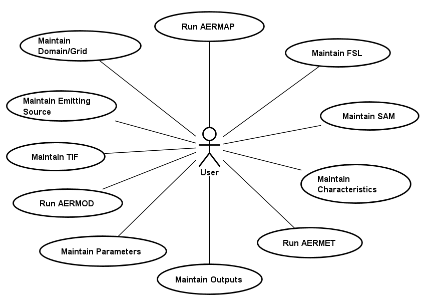

**8. DESCRIPTION OF USE CASES**

The description of the Use Cases describes each use case step by step,
showing its normal course in order to identify the correct procedures
that the system will perform. The alternative course demonstrates the
behavior alternatives that can occur in a use case.

**8.1 – Number: 01**

Use Case: **Maintain TIF**

Description: This Use Case demonstrates the inclusion of a TIF file in
the system.

Actor: User

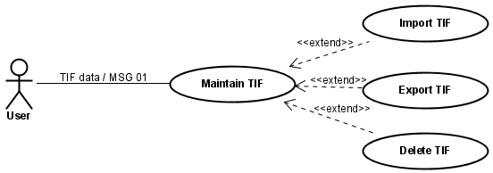

Normal Course

1.  The user enters the TIF file for import;

2.  The system validates the file;

3.  The system includes the file.

Alternative Course

2.1.  If the file description already exists in the database, the system
    issues a message (msg 01) informing that the file description
    already exists;

2.2.  If the file already exists in the database, the system issues a
    message (msg 01) informing that the file already exists;

<!-- -->

3.1.  If the user chooses to export, the system issues a message (msg 01)
    informing that the file has been downloaded;

3.2.  If the user chooses to delete, the system issues a message (msg 01)
    informing if he wants to delete the selected records.

**8.2 – Number: 02**

Use Case: **Maintain Emitting Source**

Description: This Use Case demonstrates the inclusion of an emitter
source in the system.

Actor: User

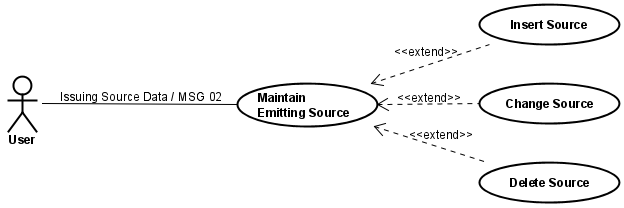

Normal Course

1.  The user informs the data of the issuing source;

2.  The system validates the data;

3.  The system includes the issuing source in the register.

Alternative Course

2.1.  If there is any null or empty field, the system issues a message
    (msg 02) requesting the completion of the field;

2.2.  If the data of the issuing source already exist in the database, the
    system issues a message (msg 02) informing that the issuing source
    is already registered;

<!-- -->

3.1.  The system issues a message (msg 02) informing that there is an
    error when trying to insert/update the record in the database, if
    the maximum number of digits of the primary key has been reached;

3.2.  The system shows the data of the emitting source and allows the user
    to change it;

3.3.  If the user chooses to delete, the system issues a message (msg 02)
    informing if he wants to delete the selected records.

**8.3 – Number: 03**

Use Case: **Maintain Domain/Grid**

Description: This Use Case demonstrates the inclusion of a modeling
domain and grid in the system.

Actor: User

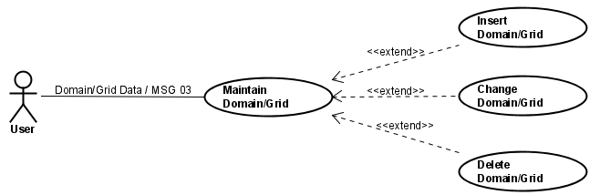

Normal Course

1.  The user enters the data of the domain and modeling grid;

2.  The system validates the data;

3.  The system includes the domain and modeling grid data in the
    registration and issues a message (msg 03) informing that the domain
    and modeling grid have been successfully recorded.

Alternative Course

2.1.  If there is any null or empty field, the system issues a message
    (msg 03) requesting the field to be filled in;

2.2.  If there is any field with an invalid value, the system issues a
    message (msg 03) informing that the field has an invalid value;

2.3.  If the domain data and modeling grid already exist in the database,
    the system issues a message (msg 03) informing that the data is
    already registered;

<!-- -->

3.1.  The system issues a message (msg 03) informing that there is an
    error when trying to insert/update the record in the database, if
    the maximum number of digits of the primary key has been reached;

3.2.  The system shows the data of the domain and modeling grid and allows
    the user to change;

3.3.  If the user chooses to delete, the system issues a message (msg 03)
    informing if he wants to delete the selected records.

**8.4 – Number: 04**

Use Case: **Run AERMAP**

Description: This Use Case demonstrates the execution of the AERMAP
preprocessor.

Actor: User

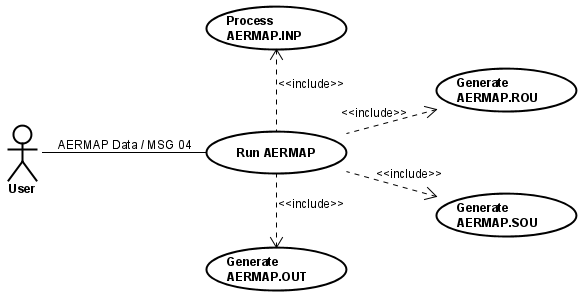

Normal Course

1.  The user runs the AERMAP preprocessor;

2.  The system validates the data;

3.  The system generates the files: AERMAP. INP, AERMAP. OUT, AERMAP.
    ROU, AERMAP. AM and writes to the database.

Alternative Course

2.1.  If the TIF file does not exist, the system issues a message (msg 04)
    informing that the file was not found for the procedure;

2.2.  If there is no domain and modeling grid, the system issues a message
    (msg 04) informing the non-existence of the registration for the
    procedure;

2.3.  If there is no AERMAP directory within the system, it emits a
    message (msg 04) informing that the directory does not exist within
    the system;

<!-- -->

3.1.  If there is an unexpected failure during processing, the system
    issues a message (msg 04) informing that the process was interrupted
    before completion;

3.2.  If the user chooses to export a file, the file is exported and the
    system issues a message (msg 04) informing that the file was
    successfully downloaded.

**8.5 – Number: 05**

Use Case: **Maintain FSL**

Description: This Use Case demonstrates the inclusion of an FSL file in
the system.

Actor: User

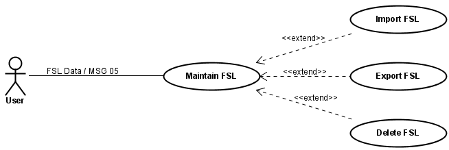

Normal Course

1.  The user enters the FSL file for import;

2.  The system validates the file;

3.  The system includes the file.

Alternative Course

2.1.  If the file description already exists in the database, the system
    issues a message (msg 05) informing that the file description
    already exists;

2.2.  If the file already exists in the database, the system issues a
    message (msg 05) informing that the file already exists;

<!-- -->

3.1.  If the user chooses to export, the system issues a message (msg 05)
    informing that the file has been downloaded;

3.2.  If the user chooses to delete, the system issues a message (msg 05)
    informing if he wants to delete the selected records.

**8.6 – Number: 06**

Use Case: **Maintain SAM**

Description: This Use Case demonstrates the inclusion of a SAM file in
the system.

Actor: User

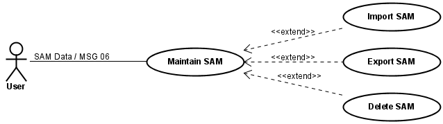

Normal Course

1.  The user enters the CSV file for import;

2.  The system validates the file;

3.  The system converts to SAM file;

4.  The system includes the file and issues a message (msg 06) informing
    that the file was successfully recorded.

Alternative Course

2.1.  If the file description already exists in the database, the system
    issues a message (msg 06) informing that the file description
    already exists;

2.2.  If the file already exists in the database, the system issues a
    message (msg 06) informing that the file already exists;

<!-- -->

3.1.  If there is no file selected for conversion, the system issues a
    message (msg 06) informing that there is no data for conversion;

3.2.  If the file for conversion is incompatible, the system issues a
    message (msg 06) informing that the file is incompatible for
    conversion;

3.3.  If there is any data missing from the file for conversion, the
    system issues a message (msg 06) informing the inexistence of a
    value for the given field;

<!-- -->

4.1.  If the user chooses to export, the system issues a message (msg 06)
    informing that the file has been downloaded;

4.2.  If the user chooses to delete, the system issues a message (msg 06)
    informing if he wants to delete the selected records.

**8.7 – Number: 07**

Use Case: **Maintain Characteristics**

Description: This Use Case demonstrates the inclusion of a definition of
surface features in the system.

Actor: User

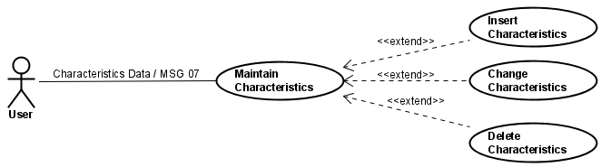

Normal Course

1.  You enter the definition data of the surface characteristics;

2.  The system validates the data;

3.  The system includes the data for defining the surface
    characteristics in the registry and issues a message (msg 07)
    informing that the data has been successfully recorded.

Alternative Course

2.1.  If there is any null or empty field, the system issues a message
    (msg 07) requesting the field to be filled in;

2.2.  If the value of the sector is greater than 360 degrees, the system
    issues a message (msg 07) informing that the sector cannot be
    greater than 360 degrees;

2.3.  If the data defining the surface characteristics already exist in
    the database, the system issues a message (msg 07) informing that
    the data is already registered;

2.4.  The system issues a message (msg 07) if there is not at least one
    characteristic in the settings register;

<!-- -->

3.1.  The system issues a message (msg 07) informing that there is an
    error when trying to insert/update the record in the database, if
    the maximum number of digits of the primary key has been reached;

3.2.  The system displays the definition data of the surface features and
    allows the user to change;

3.3.  If the user chooses to delete, the system issues a message (msg 07)
    informing if he wants to delete the selected records.

**8.8 – Number: 08**

Use Case: **Run AERMET**

Description: This Use Case demonstrates running the AERMET preprocessor.

Actor: User

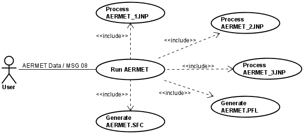

Normal Course

1.  The user runs the AERMET preprocessor;

2.  The system validates the data;

3.  The system generates the files AERMET_1.INP, AERMET_2.INP,
    AERMET_3.INP, AERMET. PFL, AERMET. SFC, writes to the database and
    issues a message (msg 08) informing that the data was successfully
    recorded.

Alternative Course

2.1.  If the FSL file does not exist, the system issues a message (msg 08)
    informing that the file was not found for the procedure;

2.2.  If the SAM file does not exist, the system issues a message (msg 08)
    informing that the file was not found for the procedure;

2.3.  If there is no definition of the surface characteristics, the system
    issues a message (msg 08) informing the non-existence of the record
    for the procedure;

2.4.  If the AERMET directory does not exist within the system, it issues
    a message (msg 08) informing that the directory does not exist
    within the system;

<!-- -->

3.1.  If there is an unexpected failure during processing, the system
    issues a message (msg 08) informing that the process was interrupted
    before completion;

3.2.  If there is invalid data in the processing, the system issues a
    message (msg 08) informing the existence of an error when generating
    the output files;

3.3.  If the user chooses to export a file, the file is exported and the
    system issues a message (msg 08) informing that the file was
    successfully downloaded.

**8.9 – Number: 09**

Use Case: **Maintain Outputs**

Description: This Use Case demonstrates the inclusion of a definition of
the output files in the system.

Actor: User

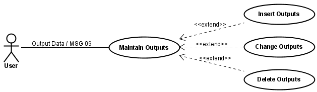

Normal Course

1.  The user enters the output data;

2.  The system validates the data;

3.  The system includes the outputs in the register and issues a message
    (msg 09) informing that the output was successfully recorded.

Alternative Course

2.1.  If there is any null or empty field, the system issues a message
    (msg 09) requesting the completion of the field;

2.2.  If the output data already exists in the database, the system issues
    a message (msg 09) informing that the output is already registered;

2.3.  If the rectangle values are invalid, the system issues a message
    (msg 09) informing that the values cannot be null or greater than
    999;

2.4.  If the maximum value is incorrect, the system issues a message
    (msg 09) informing that the maximum value cannot be greater than
    400;

2.5.  The system issues a message (msg 09) if there is not at least one
    output in the settings register;

2.6.  If the standard hourly average is incorrect, the system issues a
    message (msg 09) informing that the standard hourly average is
    different from the average of the output file;

2.7.  If the average of the standard period is incorrect, the system
    issues a message (msg 09) informing that the average of the standard
    period is different from the average of the output file;

2.8.  If the average of the output period is incorrect, the system issues
    a message (msg 09) informing that the average must be (Monthly) for
    modeling interval greater than one month;

2.9.  If the maximum value of output values is greater than the default
    maximum value, the system issues a message (msg 09) informing that
    the maximum value of output values cannot be greater than the
    default maximum value defined in the basic data;

2.10. If there are no definitions registered in the AERMET process, the
    system issues a message (msg 09) informing that the AERMET
    definitions have not been defined and asks you to perform the
    configuration to proceed;

2.11. If the time average is incompatible with the modeling period, the
    system issues a message (msg 09) informing that the time average
    must be hourly for modeling interval less than or equal to one
    month;

2.12. If the average of the period is incompatible with the modeling
    period, the system issues a message (msg 09) informing that the
    average of the period cannot be (Annual) for modeling interval less
    than one year;

<!-- -->

3.1.  The system issues a message (msg 09) informing that there is an
    error when trying to enter/update the record in the database, if the
    maximum number of digits of the primary key has been reached;

3.2.  The system shows the output data and allows the user to change it;

3.3.  If the user chooses to delete, the system issues a message (msg 09)
    informing if he wants to delete the selected records.

**8.10 – Number: 10**

Use Case: **Maintain Parameters**

Description: This Use Case demonstrates the inclusion of a parameter for
the emitting source in the system.

Actor: User

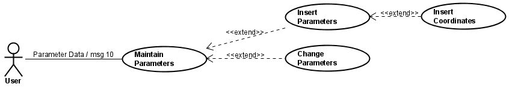

Normal Course

1.  The user informs the parameter data of the emitting source;

2.  The system validates the parameter data;

3.  The system includes the data in the registration.

Alternative Course

2.1.  If the emitting source is of the type (Polygon Area) and there are
    no registered coordinates, the system extends the Use Case to Insert
    Coordinates;

2.2.  If the issuance fee is zero, zero or empty, the system issues a
    message (msg 10) asking you to inform the issuance fee;

2.3.  If the emitting source is of the type (Point) and the height of the
    chimney is zero, zero or empty, the system issues a message (msg 10)
    asking you to inform the height of the chimney;

2.4.  If the emitting source is of the type (Point) and the exit velocity
    of the gases from the chimney is zero, zero or empty, the system
    issues a message (msg 10) requesting the completion of the field;

2.5.  If the emitting source is of the type (Point) and the diameter of
    the chimney is null, zero or empty, the system issues a message
    (msg 10) requesting the completion of the field;

2.6.  If the emitting source is of the type (Area) and the launch height
    above the ground is null, zero or empty, the system issues a message
    (msg 10) requesting the completion of the field;

2.7.  If the emitting source is of type (Area) and the length of side X of
    the area is zero, zero or empty and the angle is zero degrees, the
    system issues a message (msg 10) requesting the completion of the
    field;

2.8.  If the emitting source is of the type (Polygon Area) and the number
    of vertices is invalid, the system issues a message (msg 10) asking
    you to inform the minimum quantity of 3 and maximum of 20 vertices;

2.9.  If the emitting source is of the type (Polygon Area) and the number
    of coordinates in the coordinate register is different from the
    number of vertices, the system issues a message (msg 10) requesting
    the correct completion of the field;

2.10. If the emitting source is of the type (Polygon Area) and the first
    coordinate of the coordinate register is different from the
    coordinate of the emitting source, the system issues a message
    (msg 10) asking you to inform the coordinate of the emitting source
    in editing;

2.11. If the emitting source is of the type (Circle Area) and the radius
    is null, zero or empty, the system issues a message (msg 10) asking
    you to inform the radius of the circular area in meters;

2.12. If the emitting source is of the type (Circle Area) and the launch
    height above the ground is null, zero or empty, the system issues a
    message (msg 10) requesting the completion of the field.

**8.11 – Number: 11**

Use Case: **Maintain Coordinates**

Description: This use case demonstrates the inclusion of coordinates in
the system.

Actor: User

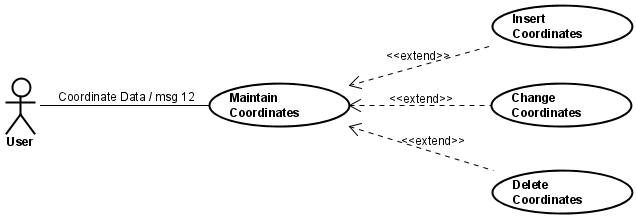

Normal Course

1.  The user informs the coordinates;

2.  The system does the validation;

3.  The system includes the coordinates.

Alternative Course

2.1.  If there is any null or empty field, the system issues a message
    (msg 12) requesting the completion of the field;

2.2.  If there are already registered coordinates, the system issues a
    message (msg 12) informing that the coordinates are already
    registered;

<!-- -->

3.1.  The system shows the coordinates and allows the user to change;

3.2.  If the user chooses to delete, the system issues a message (msg 12)
    informing if he wants to delete the selected records.

**8.12 – Number: 12**

Use Case: **Run AERMOD**

Description: This Use Case demonstrates the execution of the AERMOD main
processor.

Actor: User

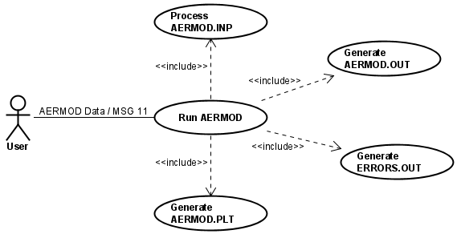

Normal Course

1.  The user runs the AERMOD main processor;

2.  The system validates the data;

3.  The system generates the AERMOD files. INP, AERMOD. OUT, ERRORS.
    OUT, AERMOD. PLT, writes to the database and issues a message
    (msg 11) informing that the data has been successfully recorded.

Alternative Course

2.1.  If the ROU/SOU files do not exist, the system issues a message
    (msg 11) informing that the files were not found for the procedure;

2.2.  If the PFL/SFC files do not exist, the system issues a message
    (msg 10) informing that the files were not found for the procedure;

2.3.  If there is no definition of the surface characteristics, the system
    issues a message (msg 10) informing the non-existence of the record
    for the procedure;

2.4.  If the FSL file does not exist, the system issues a message (msg 10)
    asking you to inform the file for the procedure;

2.5.  If the SAM file does not exist, the system issues a message (msg 10)
    asking you to inform the file for the procedure;

2.6.  If there is no AERMOD directory within the system, it issues a
    message (msg 10) informing that the directory does not exist within
    the system;

2.7.  If there are no definitions registered in the AERMOD process, the
    system issues a message (msg 10) informing the non-existence of
    definitions for the procedure;

2.8.  If there is invalid altitude data or non-existent emitting source,
    the system issues a message (msg 10) informing the non-existence for
    the procedure;

2.9.  If there is no parameter for the emitting source of the type
    (Point), the system issues a message (msg 10) informing that the
    parameter was not found;

2.10. If there is no parameter for the emitting source of the type (Area),
    the system issues a message (msg 10) informing that the parameter
    was not found;

2.11. If there is no parameter for the emitting source of the type
    (Polygon Area), the system issues a message (msg 10) informing the
    non-existence of the parameter;

2.12. If there is no parameter for the emitting source of the type (Circle
    Area), the system issues a message (msg 10) informing the
    non-existence of the parameter;

<!-- -->

3.1.  If there is an unexpected failure during processing, the system
    issues a message (msg 10) informing that the process was interrupted
    before completion;

3.2.  If there is invalid data in the processing, the system issues a
    message (msg 10) informing the existence of an error when generating
    the output files.

3.3.  If the user chooses to export a file, the file is exported and the
    system issues a message (msg 10) informing that the file was
    successfully downloaded.

**9. CLASS DIAGRAM**

The class diagram shows how objects are arranged by the system, which
are used to give a broad view of the system in its static form, showing
the main classes, their attributes and methods, as well as the way in
which they relate to each other.

**9.1 – System Class Diagram**

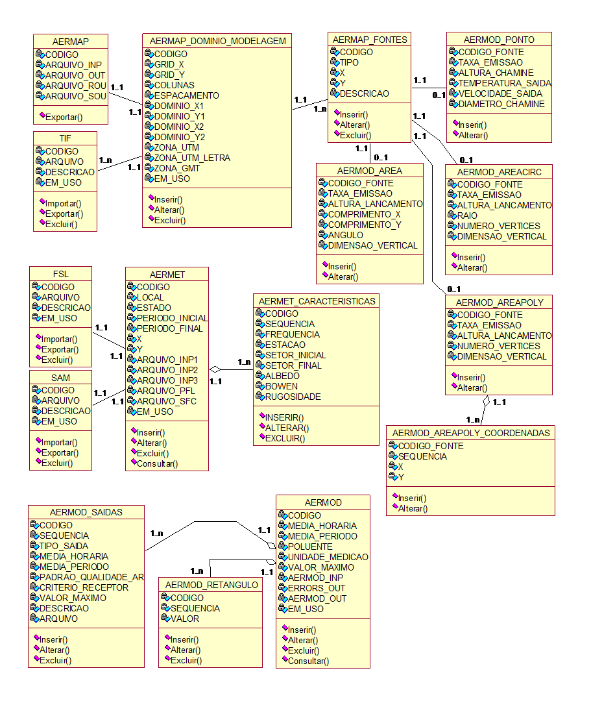

**10. SEQUENCE DIAGRAM**

The sequence diagram must portray the message exchanges carried out by
the system for the execution of the operations defined in the use case
and thus demonstrate the behavior of the system according to the
functionalities.

In this project, for each identified use case, a corresponding sequence
diagram was prepared.

**10.1 – Use Case: Maintain TIF**

Normal Course: Insert TIF file

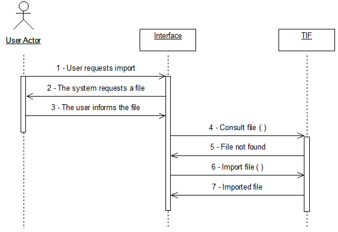

**10.2 – Use Case: Maintain Emitting Source**

Normal Course: Insert Emitting Source

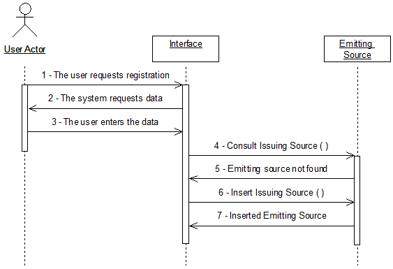

**10.3 – Use Case: Maintain Domain/Grid**

Normal Course: Insert Domain/Modeling Grid

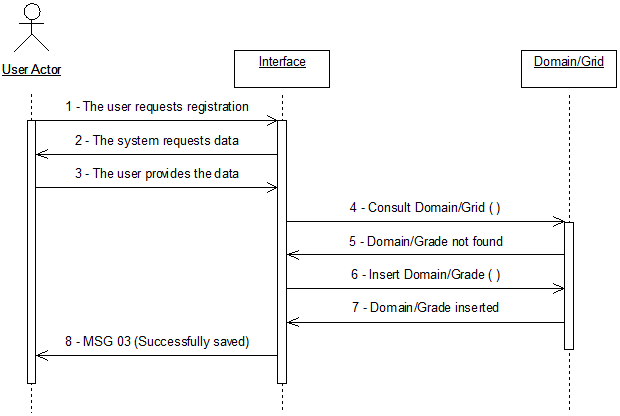

**10.4 – Use Case: Run AERMAP**

Normal Course: Run AERMAP Preprocessor

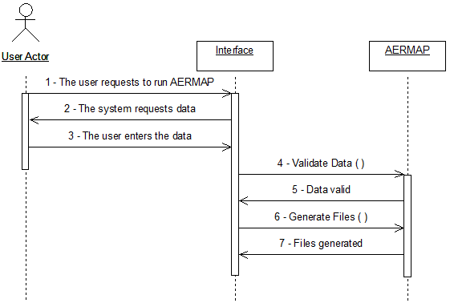

**10.5 – Use Case: Maintain FSL**

Normal Course: Insert FSL File

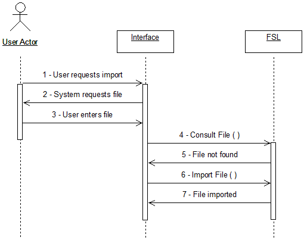

**10.6 – Use Case: Maintain SAM**

Normal Course: Insert SAM File

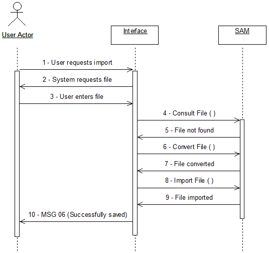

**10.7 – Use Case: Maintain Characteristics**

Normal Course: Inserting Surface Characteristics

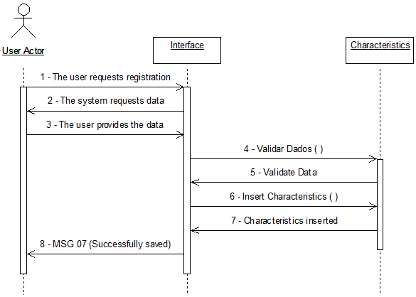

**10.8 – Use Case: Run AERMET**

Normal Course: Run AERMET Preprocessor

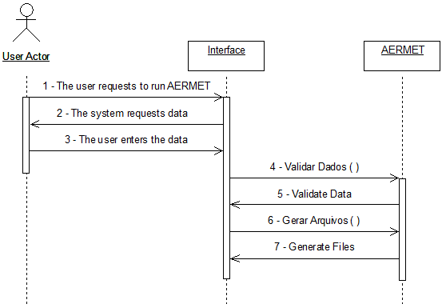

**10.9 – Use Case: Maintain Outputs**

Normal Course: Entering Output Definitions

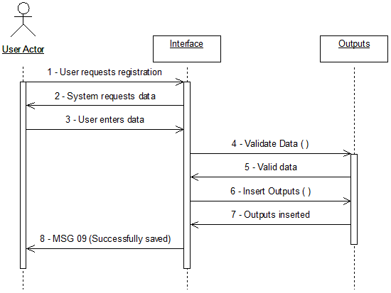

**10.10 – Use Case: Maintain Parameters**

Normal Course: Entering Output Source Parameters

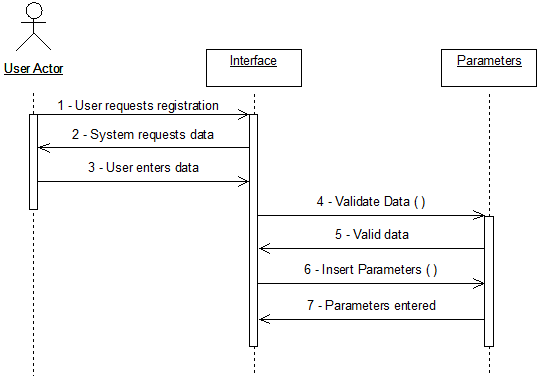

**10.11 – Use Case: Maintain Coordinates**

Alternative Course: Extend Use Case to enter parameter coordinates.

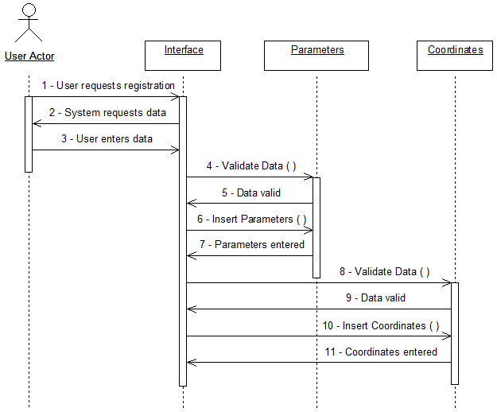

**10.12 – Use Case: Run AERMOD**

Normal Course: Run AERMOD Main Processor

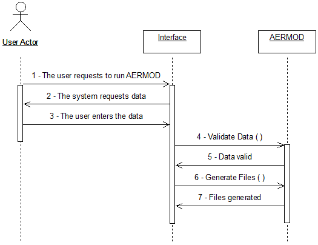

**11. PHYSICAL DESCRIPTION OF THE DATA**

The Physical Description of Data is intended to show how the data is
physically in the system. With this, the physical description of the
data in this project shows all the database tables contained in the
system. It shows its attributes, data types, size of that data, a brief
description of the attribute, whether the field is required or not, and
whether the field is a primary or foreign key.

**11.1 Physical Description of System Data**

CLASS AND TABLE: TIF

| Attribute   |   Kind   | Tam | Description          | Comp | Key |
|-------------|:--------:|:---:|----------------------|:----:|:---:|
| CODE        |   Int    |  5  | File Code            | Yes  | PK  |
| ARCHIVE     | Longblob |     | Topographic archive  | Yes  |     |
| DESCRIPTION | Varchar  | 250 | File Description     | Yes  |     |
| EM_USO      | Tinyint  |  1  | File in use (yes/no) | Yes  |     |

CLASS AND TABLE: AERMAP_FONTES

| Attribute   |  Kind   | Tam  | Description        | Comp | Key |
|-------------|:-------:|:----:|--------------------|:----:|:---:|
| CODE        |   Int   |  5   | Registration Code  | Yes  | PK  |
| KIND        |   Int   |  2   | Source type        | Yes  |     |
| X           | Decimal | 13,3 | Fountain longitude | Yes  |     |
| Y           | Decimal | 13,3 | Source latitude    | Yes  |     |
| DESCRIPTION | Varchar | 100  | Font Description   | Yes  |     |

CLASS AND TABLE: AERMAP_DOMINIO_MODELAGEM

| Attribute      |  Kind   | Tam  | Description                    | Comp | Key |
|----------------|:-------:|:----:|--------------------------------|:----:|:---:|
| CODE           |   Int   |  5   | Registration Code              | Yes  | PK  |
| GRID_X         | Decimal | 13,3 | Long. Bottom left of the grid  | Yes  |     |
| GRID_Y         | Decimal | 13,3 | Lat. bottom left of the grid   | Yes  |     |
| COLUMNS        |   Int   |  6   | Number of columns              | Yes  |     |
| SPACING        |   Int   |  6   | Distance between columns       | Yes  |     |
| DOMINIO_X1     | Decimal | 13,3 | Long. Lower left of the domain | Yes  |     |
| DOMINIO_Y1     | Decimal | 13,3 | Lower left domain lat.         | Yes  |     |
| DOMINIO_X2     | Decimal | 13,3 | Long. Top right of the domain  | Yes  |     |
| DOMINIO_Y2     | Decimal | 13,3 | Upper right lat. of the domain | Yes  |     |
| ZONA_UTM       |   Int   |  5   | UTM Zone                       | Yes  |     |
| ZONA_UTM_LETRA |  Char   |  1   | UTM Zone Letter                | Yes  |     |
| ZONA_GMT       |   Int   |  5   | Univ. Time coordinated         | Yes  |     |
| EM_USO         | Tinyint |  1   | File in use (yes/no)           | Yes  |     |

CLASS AND TABLE: AERMAP

| Attribute   |   Kind   | Tam | Description                           | Comp | Key |
|-------------|:--------:|:---:|---------------------------------------|:----:|:---:|
| CODE        |   Int    |  5  | File Code                             | Yes  | PK  |
| ARQUIVO_INP | Longblob |     | Input File                            | Yes  |     |
| ARQUIVO_OUT | Longblob |     | Execution log file                    | Yes  |     |
| ARQUIVO_ROU | Longblob |     | Receiver Points Archive               | Yes  |     |
| ARQUIVO_SOU | Longblob |     | Altitude file of the emitting sources | Yes  |     |

CLASS AND TABLE: FSL

| Attribute   |   Kind   | Tam | Description           | Comp | Key |
|-------------|:--------:|:---:|-----------------------|:----:|:---:|
| CODE        |   Int    |  5  | File Code             | Yes  | PK  |
| ARCHIVE     | Longblob |     | Radio Polling Archive | Yes  |     |
| DESCRIPTION | Varchar  | 250 | File Description      | Yes  |     |
| EM_USO      | Tinyint  |  1  | File in use (yes/no)  | Yes  |     |

CLASS AND TABLE: SAM

| Attribute   |   Kind   | Tam | Description          | Comp | Key |
|-------------|:--------:|:---:|----------------------|:----:|:---:|
| CODE        |   Int    |  5  | File Code            | Yes  | PK  |
| ARCHIVE     | Longblob |     | Weather archive      | Yes  |     |
| DESCRIPTION | Varchar  | 250 | File Description     | Yes  |     |
| EM_USO      | Tinyint  |  1  | File in use (yes/no) | Yes  |     |

CLASS AND TABLE: AERMET

| Attribute       |   Kind   | Tam  | Description                        | Comp | Key |
|-----------------|:--------:|:----:|------------------------------------|:----:|:---:|
| CODE            |   Int    |  5   | Registration Code                  | Yes  | PK  |
| LOCAL           | Varchar  |  37  | Modeling location                  | Yes  |     |
| STATE           |   Int    |  2   | Modeling UF                        | Yes  |     |
| PERIODO_INICIAL |   Date   |      | Initial modeling period            | Yes  |     |
| PERIODO_FINAL   |   Date   |      | Final Modeling Period              |      |     |
| X               | Decimal  | 13,3 | Longitude of the site              | Yes  |     |
| Y               | Decimal  | 13,3 | Site latitude                      | Yes  |     |
| ARQUIVO_INP1    | Longblob |      | Input File for Configuring FSL/SAM |      |     |
| ARQUIVO_INP2    | Longblob |      | Input file to set the period       | Yes  |     |
| ARQUIVO_INP3    | Longblob |      | Input File for Configuring PFL/SFC | Yes  |     |
| ARQUIVO_PFL     | Longblob |      | Vertical Profile File              | Yes  |     |
| ARQUIVO_SFC     | Longblob |      | Surface file                       | Yes  |     |
| EM_USO          | Tinyint  |  1   | File in use (yes/no)               | Yes  |     |

CLASS AND TABLE: AERMET_CARACTERISTICAS

| Attribute | Kind | Tam | Description | Comp | Key |
|----|:--:|:--:|----|:--:|:--:|
| CODE | Int | 5 | Registration Code | Yes | FK |
| SEQUENCE | Int | 5 | Record sequence | Yes | PK |
| FREQUENCY | Int | 1 | Frequency of variation (yearly/seasonal/monthly) | Yes |  |
| STATION | Int | 1 | Season (Spring/Summer/Fall/Winter) | Yes |  |
| SETOR_INICIAL | Int | 1 | Initial sector in degrees | Yes |  |
| SETOR_FINAL | Int | 1 | Final Sector in Degrees | Yes |  |
| ALBEDO | Decimal | 6,2 | Variation in radiation incidence | Yes |  |
| BOWEN | Decimal | 6,2 | Relationship between sensible heat flux (H) and latent heat flux (LE) |  |  |
| ROUGHNESS | Decimal | 6,2 | Friction Layer Height for Calculating Friction Velocity | Yes |  |

CLASS AND TABLE: AERMOD

| Attribute | Kind | Tam | Description | Comp | Key |
|----|:--:|:--:|----|:--:|:--:|
| CODE | Int | 5 | File Code | Yes | PK |
| MEDIA_HORARIA | Int | 2 | Hourly time average | Yes |  |
| MEDIA_PERIODO | Int | 1 | Period time average | Yes |  |
| POLLUTANT | Int | 3 | Pollutant | Yes |  |
| UNIDADE_MEDICAO | Varchar | 100 | Measuring unit | Yes |  |
| VALOR_MAXIMO | Int | 3 | Maximum Output Value for Summary Tables | Yes |  |
| AERMOD_INP | Longblob |  | Input File | Yes |  |
| AERMOD_OUT | Longblob |  | Execution log | Yes |  |
| ERRORS_OUT | Longblob |  | List of error messages, tips, or suggestions | Yes |  |
| EM_USO | Tinyint | 1 | File in use (yes/no) | Yes |  |

CLASS AND TABLE: AERMOD_RETANGULO

| Attribute | Kind | Tam | Description | Comp | Key |
|----|:--:|:--:|----|:--:|:--:|
| CODE | Int | 5 | Registration Code | Yes | FK |
| SEQUENCE | Int | 5 | Record sequence | Yes | PK |
| VALUE | Int | 3 | Value Per Receiver for Output Option for Summary Tables | Yes |  |

CLASS AND TABLE: AERMOD_SAIDAS

| Attribute | Kind | Tam | Description | Comp | Key |
|----|:--:|:--:|----|:--:|:--:|
| CODE | Int | 5 | Registration Code | Yes | FK |
| SEQUENCE | Int | 5 | Record sequence | Yes | PK |
| TIPO_SAIDA | Int | 1 | Output Type (maxfile, plotfile, postfile, rankfile) | Yes |  |
| MEDIA_HORARIA | Int | 2 | Hourly time average | Yes |  |
| MEDIA_PERIODO | Int | 1 | Period time average | Yes |  |
| PADRAO_QUALIDADE_AR | Decimal | 5,1 | Air quality standard | Yes |  |
| CRITERIO_RECEPTOR | Int | 1 | Receiver Criterion (First/Second) | Yes |  |
| VALOR_MAXIMO | Int | 3 | Maximum conc. value ref. magnitude of impact | Yes |  |
| DESCRIPTION | Varchar | 44 | File Description | Yes |  |
| ARCHIVE | Longblob |  | PLT Output File | Yes |  |

CLASS AND TABLE: AERMOD_PONTO

| Attribute         |  Kind   | Tam | Description        | Comp | Key |
|-------------------|:-------:|:---:|--------------------|:----:|:---:|
| CODIGO_FONTE      |   Int   |  5  | Source code        | Yes  | FK  |
| TAXA_EMISSAO      | Decimal | 7,3 | Issuance rate      | Yes  |     |
| ALTURA_CHAMINE    | Decimal | 7,3 | Chimney height     | Yes  |     |
| TEMPERATURA_SAIDA | Decimal | 7,3 | Outlet Temperature | Yes  |     |
| VELOCIDADE_SAIDA  | Decimal | 7,3 | Output Speed       | Yes  |     |
| DIAMETRO_CHAMINE  | Decimal | 7,3 | Chimney diameter   | Yes  |     |

CLASS AND TABLE: AERMOD_AREA

| Attribute         |  Kind   | Tam | Description        | Comp | Key |
|-------------------|:-------:|:---:|--------------------|:----:|:---:|
| CODIGO_FONTE      |   Int   |  5  | Source code        | Yes  | FK  |
| TAXA_EMISSAO      | Decimal | 7,3 | Issuance rate      | Yes  |     |
| ALTURA_LANCAMENTO | Decimal | 7,3 | Launch height      | Yes  |     |
| COMPRIMENTO_X     | Decimal | 7,3 | X-side length      | Yes  |     |
| COMPRIMENTO_Y     | Decimal | 7,3 | Y-side length      |  No  |     |
| ANGLE             | Decimal | 7,3 | Orientation angle  |  No  |     |
| DIMENSAO_VERTICAL | Decimal | 7,3 | Vertical Dimension |  No  |     |

CLASS AND TABLE: AERMOD_AREAPOLY

| Attribute         |  Kind   | Tam | Description        | Comp | Key |
|-------------------|:-------:|:---:|--------------------|:----:|:---:|
| CODIGO_FONTE      |   Int   |  5  | Source code        | Yes  | FK  |
| TAXA_EMISSAO      | Decimal | 7,3 | Issuance rate      | Yes  |     |
| ALTURA_LANCAMENTO | Decimal | 7,3 | Release Height     | Yes  |     |
| NUMERO_VERTICES   |   Int   |  2  | Number of vertices | Yes  |     |
| DIMENSAO_VERTICAL | Decimal | 7,3 | Vertical Dimension |  No  |     |

CLASS AND TABLE: AERMOD_AREAPOLY_COORDENADAS

| Attribute    |  Kind   | Tam  | Description     | Comp | Key |
|--------------|:-------:|:----:|-----------------|:----:|:---:|
| CODIGO_FONTE |   Int   |  5   | Source code     | Yes  | FK  |
| SEQUENCE     |   Int   |  5   | Record sequence | Yes  | FK  |
| X            | Decimal | 13,3 | Longitude       | Yes  |     |
| Y            | Decimal | 13,3 | Latitude        | Yes  |     |

CLASS AND TABLE: AERMOD_AREACIRC

| Attribute         |  Kind   | Tam | Description             | Comp | Key |
|-------------------|:-------:|:---:|-------------------------|:----:|:---:|
| CODIGO_FONTE      |   Int   |  5  | Source code             | Yes  | FK  |
| TAXA_EMISSAO      | Decimal | 7,3 | Issuance rate           | Yes  |     |
| ALTURA_LANCAMENTO | Decimal | 7,3 | Release Height          | Yes  |     |
| RAY               | Decimal | 7,3 | Radius of circular area | Yes  |     |
| NUMERO_VERTICES   |   Int   |  2  | Number of vertices      |  No  |     |
| DIMENSAO_VERTICAL | Decimal | 7,3 | Vertical Dimension      |  No  |     |

CLASS AND TABLE: HELP

| Attribute |    Kind    | Tam | Description       | Comp | Key |
|-----------|:----------:|:---:|-------------------|:----:|:---:|
| CODE      |    Int     | 10  | Registration Code | Yes  | PK  |
| MESSAGE   | Mediumtext |     | Help message      | Yes  |     |

**12. IMPLEMENTATION**

The software, source code, database, and installation guide are
available on the platform *web*
[www.aermod.infinityfreeapp.com](http://www.aermod.infinityfreeapp.com).
Professionals, researchers or students in the area can use the software
for simulations, atmospheric dispersion modeling and, if necessary,
future implementations or improvements. For more information or
questions, please contact us via email
<aermod.infinityfreeapp@gmail.com> or <borges2@hotmail.com>.

If there is a version update, the user will be notified by the software
about the new version, allowing them to abort or complete the
installation process. The update can also be done through the platform
*web* Doing the *download* of the installer and carrying out its
execution.

**REFERENCES**

BOOCH, GRADY. **UML:** User's Guide, trans. Fabio Freitas. Rio de
Janeiro: Editora Campus, 2000.

MACHADO, FELIPE NERY RODRIGUES. **Database design:** a practical view.
São Paulo: Editora Érica. 2002.

